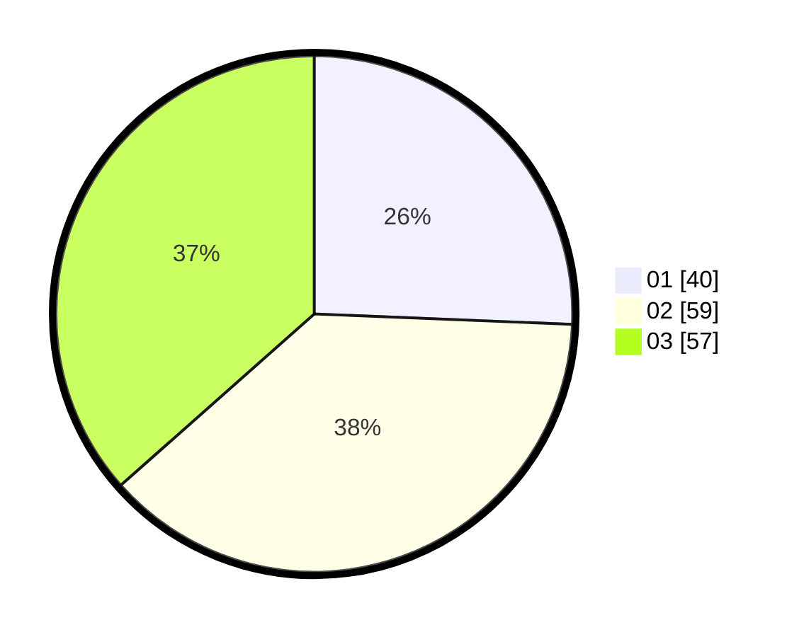

# Hasil

Hasil perolehan suara paslon dapat dilihat pada file paslon-01.txt, paslon-02.txt, dan paslon-03.txt.

Jika tidak ada, artinya data tersebut belum ada pada SIREKAP.

## Perolehan Suara

 * Paslon 01: **40**.
 * Paslon 02: **59**.
 * Paslon 03: **57**.

## Foto C Plano

https://sirekap-obj-formc.kpu.go.id/5dcc/pemilu/ppwp/31/73/06/10/05/3173061005179-20240215-021722--6a350052-5139-46e1-b0cb-31ed3b0143c7.jpg

https://sirekap-obj-formc.kpu.go.id/5dcc/pemilu/ppwp/31/73/06/10/05/3173061005179-20240215-012730--1cb987aa-7dc3-4418-bad8-cd41129140ff.jpg

https://sirekap-obj-formc.kpu.go.id/5dcc/pemilu/ppwp/31/73/06/10/05/3173061005179-20240214-213658--909b903f-6515-4e04-a0fa-9d10a58fc2cb.jpg
