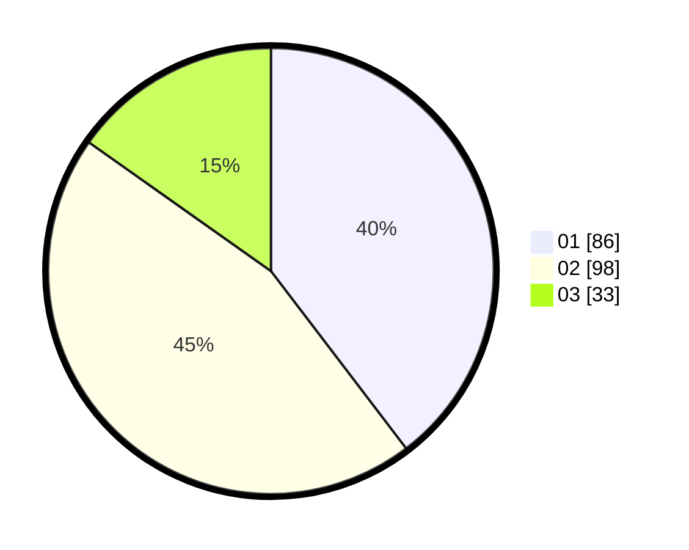

# Hasil

Hasil perolehan suara paslon dapat dilihat pada file paslon-01.txt, paslon-02.txt, dan paslon-03.txt.

Jika tidak ada, artinya data tersebut belum ada pada SIREKAP.

## Perolehan Suara

 * Paslon 01: **86**.
 * Paslon 02: **98**.
 * Paslon 03: **33**.

## Foto C Plano

https://sirekap-obj-formc.kpu.go.id/0a9f/pemilu/ppwp/31/73/06/10/05/3173061005180-20240214-232258--f8c75607-44f1-47ee-83d1-5124ebee7b3e.jpg

https://sirekap-obj-formc.kpu.go.id/0a9f/pemilu/ppwp/31/73/06/10/05/3173061005180-20240214-232507--af260e93-0108-4d69-8708-b0272cd66b84.jpg

https://sirekap-obj-formc.kpu.go.id/0a9f/pemilu/ppwp/31/73/06/10/05/3173061005180-20240214-232622--057a5921-bc5a-4054-ba38-7fec708631ec.jpg
