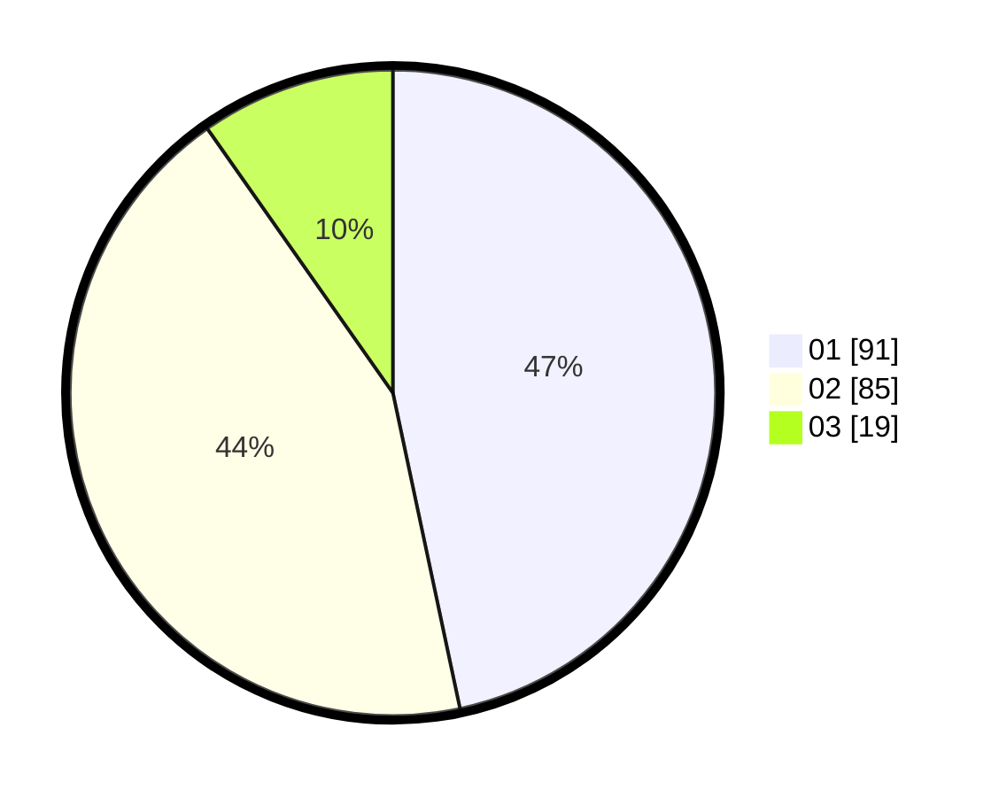

# Hasil

Hasil perolehan suara paslon dapat dilihat pada file paslon-01.txt, paslon-02.txt, dan paslon-03.txt.

Jika tidak ada, artinya data tersebut belum ada pada SIREKAP.

## Perolehan Suara

 * Paslon 01: **91**.
 * Paslon 02: **85**.
 * Paslon 03: **19**.

## Foto C Plano

https://sirekap-obj-formc.kpu.go.id/69aa/pemilu/ppwp/31/73/06/10/05/3173061005182-20240214-203007--b4ca2511-0bac-446d-a4f0-5911465999da.jpg

https://sirekap-obj-formc.kpu.go.id/69aa/pemilu/ppwp/31/73/06/10/05/3173061005182-20240214-203138--e1f75892-7317-4693-b348-e03c7ccc6fc6.jpg

https://sirekap-obj-formc.kpu.go.id/69aa/pemilu/ppwp/31/73/06/10/05/3173061005182-20240214-203200--3e9d855d-4a08-4518-b9f8-48c1c7023d73.jpg

## DATA PEMILIH TETAP

Jumlah pemilih dalam DPT: **274**.
 * L: **136**.
 * P: **138**.

## DATA PENGGUNA HAK PILIH

Jumlah pengguna hak pilih dalam DPT: **194**.
 * L: **94**.
 * P: **100**.

Jumlah pengguna hak pilih dalam DPTb: **1**.
 * L: **1**.
 * P: **0**.

Jumlah pengguna hak pilih dalam DPK: **1**.
 * L: **1**.
 * P: **0**.

Jumlah pengguna hak pilih: **196**.
 * L: **96**.
 * P: **100**.

## JUMLAH SUARA SAH DAN TIDAK SAH

JUMLAH SELURUH SUARA SAH: **195**.

JUMLAH SUARA TIDAK SAH: **1**.

JUMLAH SELURUH SUARA SAH DAN SUARA TIDAK SAH: **196**.
