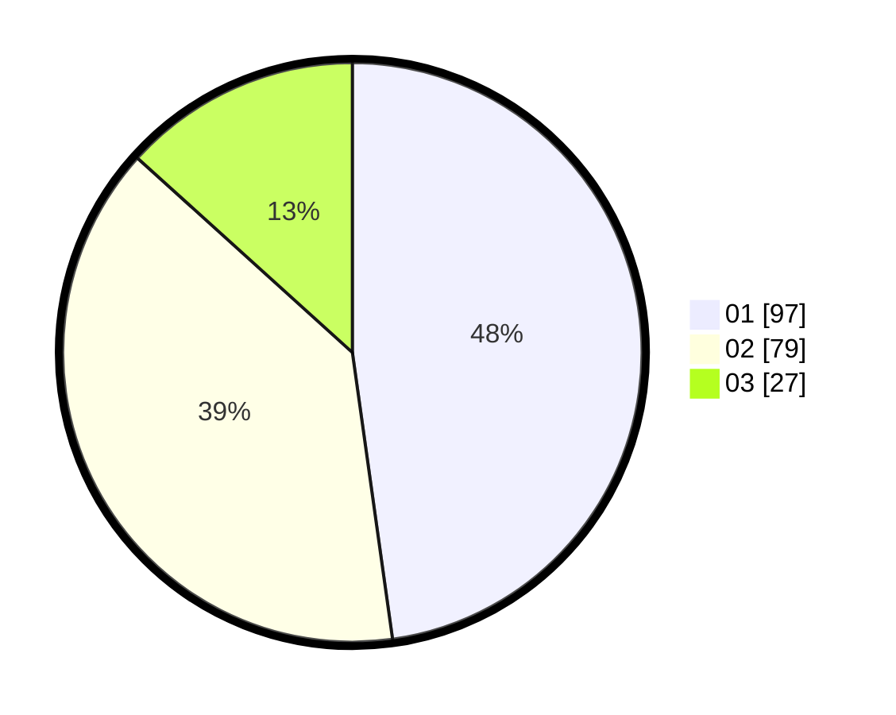

# Hasil

Hasil perolehan suara paslon dapat dilihat pada file paslon-01.txt, paslon-02.txt, dan paslon-03.txt.

Jika tidak ada, artinya data tersebut belum ada pada SIREKAP.

## Perolehan Suara

 * Paslon 01: **97**.
 * Paslon 02: **79**.
 * Paslon 03: **27**.

## Foto C Plano

https://sirekap-obj-formc.kpu.go.id/7c42/pemilu/ppwp/31/73/06/10/05/3173061005183-20240214-232538--07267f42-6fee-400d-b2ee-d45f443212b7.jpg

https://sirekap-obj-formc.kpu.go.id/7c42/pemilu/ppwp/31/73/06/10/05/3173061005183-20240214-232842--3e28829d-1fa7-4a4e-b1e8-48f943bd3bc1.jpg

https://sirekap-obj-formc.kpu.go.id/7c42/pemilu/ppwp/31/73/06/10/05/3173061005183-20240214-233137--332f97ed-3a8e-47d7-85f9-a0d89c5a88b9.jpg
