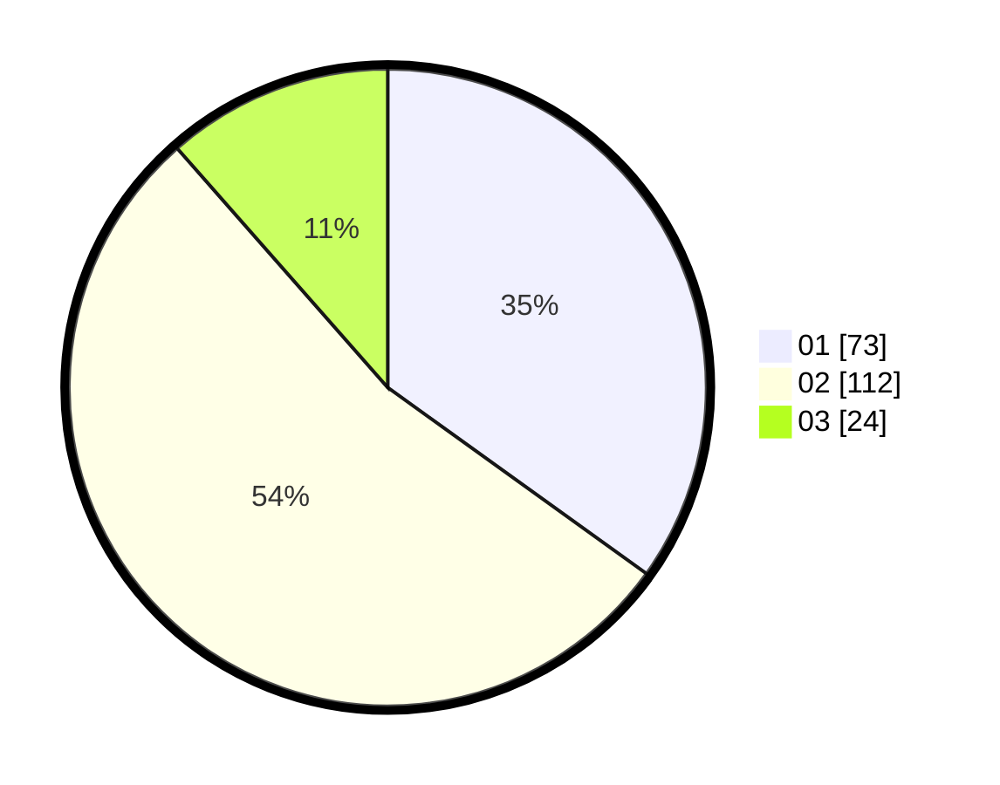

# Hasil

Hasil perolehan suara paslon dapat dilihat pada file paslon-01.txt, paslon-02.txt, dan paslon-03.txt.

Jika tidak ada, artinya data tersebut belum ada pada SIREKAP.

## Perolehan Suara

 * Paslon 01: **73**.
 * Paslon 02: **112**.
 * Paslon 03: **24**.

## Foto C Plano

https://sirekap-obj-formc.kpu.go.id/ac1c/pemilu/ppwp/31/73/06/10/05/3173061005184-20240214-204856--7337d135-1b33-4bad-98fd-2691352943c1.jpg

https://sirekap-obj-formc.kpu.go.id/ac1c/pemilu/ppwp/31/73/06/10/05/3173061005184-20240214-205056--d6d1d1c4-c85d-41c8-8ad8-c0490cc4465a.jpg

https://sirekap-obj-formc.kpu.go.id/ac1c/pemilu/ppwp/31/73/06/10/05/3173061005184-20240214-205158--2cc949e8-f15b-477e-ad42-38e4a1f8d5a0.jpg
