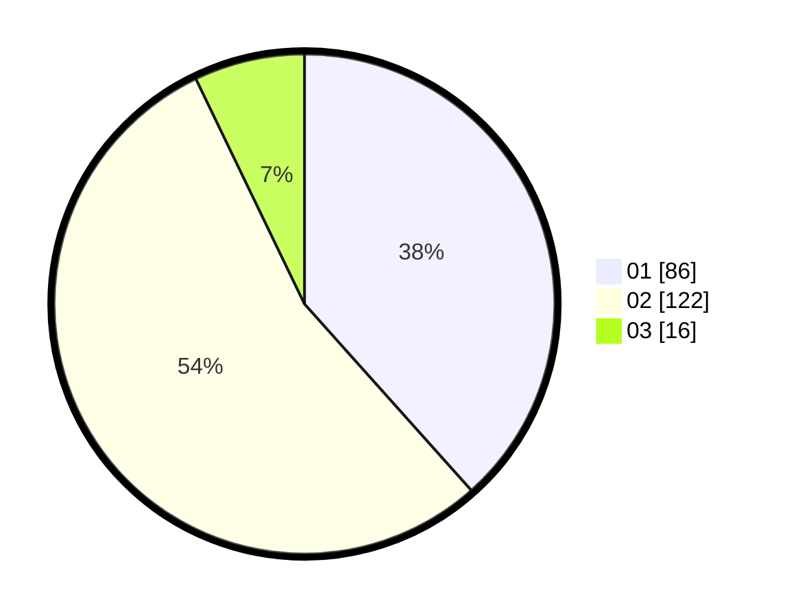

# Hasil

Hasil perolehan suara paslon dapat dilihat pada file paslon-01.txt, paslon-02.txt, dan paslon-03.txt.

Jika tidak ada, artinya data tersebut belum ada pada SIREKAP.

## Perolehan Suara

 * Paslon 01: **86**.
 * Paslon 02: **122**.
 * Paslon 03: **16**.

## Foto C Plano

https://sirekap-obj-formc.kpu.go.id/dbc7/pemilu/ppwp/31/73/06/10/05/3173061005190-20240215-113305--e3e0bea2-feb8-4cfb-8b3b-899bb2af27d6.jpg

https://sirekap-obj-formc.kpu.go.id/dbc7/pemilu/ppwp/31/73/06/10/05/3173061005190-20240215-114007--eebf7017-4fff-4885-bd4b-753e30a86757.jpg
