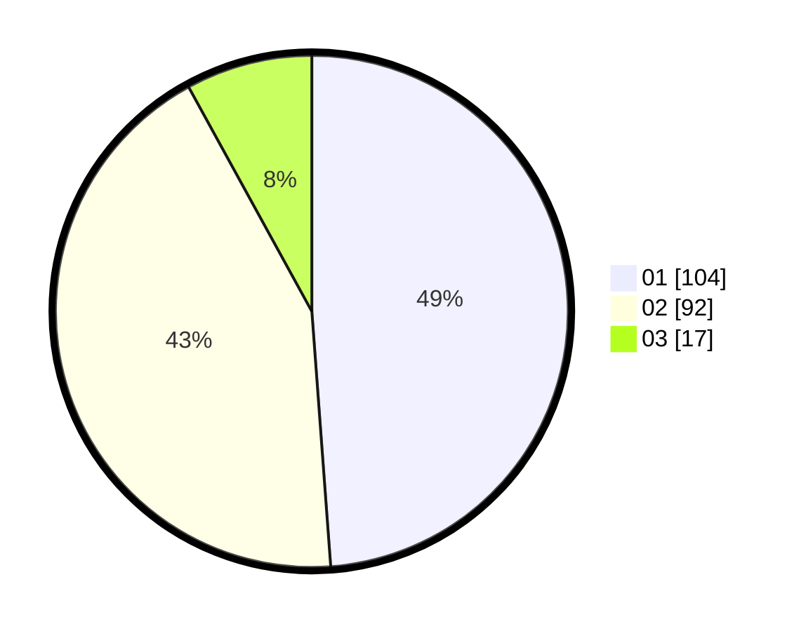

# Hasil

Hasil perolehan suara paslon dapat dilihat pada file paslon-01.txt, paslon-02.txt, dan paslon-03.txt.

Jika tidak ada, artinya data tersebut belum ada pada SIREKAP.

## Perolehan Suara

 * Paslon 01: **104**.
 * Paslon 02: **92**.
 * Paslon 03: **17**.

## Foto C Plano

https://sirekap-obj-formc.kpu.go.id/23d2/pemilu/ppwp/31/73/06/10/05/3173061005191-20240214-225306--16957e98-104e-49f5-a7cb-4d712b6010b8.jpg

https://sirekap-obj-formc.kpu.go.id/23d2/pemilu/ppwp/31/73/06/10/05/3173061005191-20240214-225508--e002030c-eff3-489a-a8ed-1ff32746d745.jpg

https://sirekap-obj-formc.kpu.go.id/23d2/pemilu/ppwp/31/73/06/10/05/3173061005191-20240214-225558--bd56c822-396f-4146-a3a8-4cc3842bb05e.jpg
