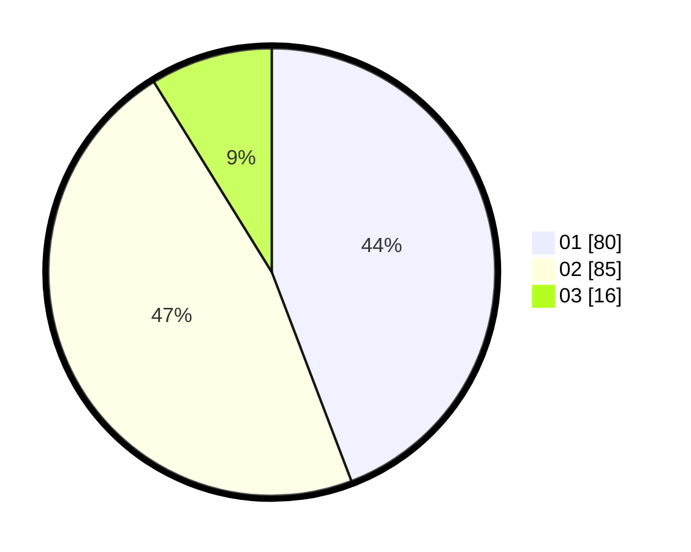

# Hasil

Hasil perolehan suara paslon dapat dilihat pada file paslon-01.txt, paslon-02.txt, dan paslon-03.txt.

Jika tidak ada, artinya data tersebut belum ada pada SIREKAP.

## Perolehan Suara

 * Paslon 01: **80**.
 * Paslon 02: **85**.
 * Paslon 03: **16**.

## Foto C Plano

https://sirekap-obj-formc.kpu.go.id/9261/pemilu/ppwp/31/73/06/10/05/3173061005192-20240214-224846--0767d184-f053-45fd-9240-91b7e605ba49.jpg

https://sirekap-obj-formc.kpu.go.id/9261/pemilu/ppwp/31/73/06/10/05/3173061005192-20240214-225024--f5b175d2-5d4c-4ec5-9852-1ba1c13f9bd4.jpg

https://sirekap-obj-formc.kpu.go.id/9261/pemilu/ppwp/31/73/06/10/05/3173061005192-20240214-225125--c2a4c9f7-1614-44fe-94cd-8271dbe288aa.jpg
