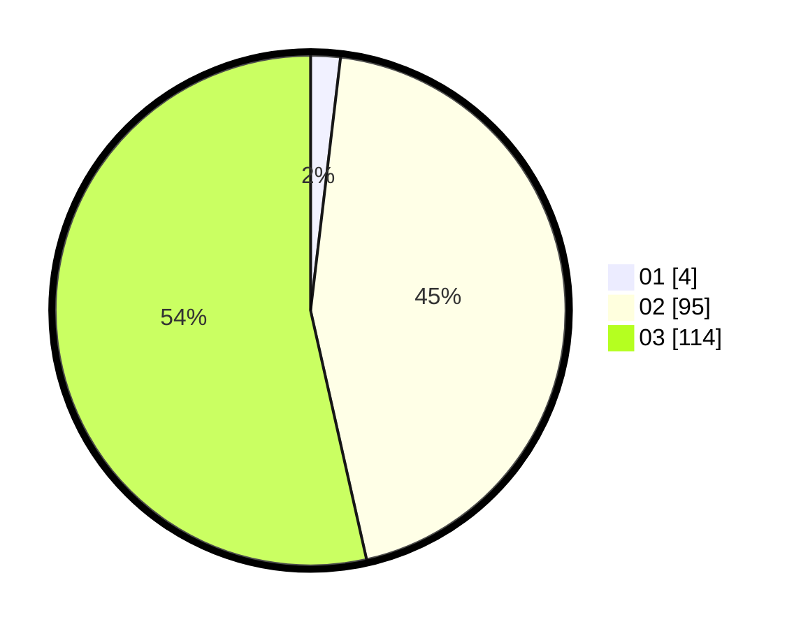

# Hasil

Hasil perolehan suara paslon dapat dilihat pada file paslon-01.txt, paslon-02.txt, dan paslon-03.txt.

Jika tidak ada, artinya data tersebut belum ada pada SIREKAP.

## Perolehan Suara

 * Paslon 01: **4**.
 * Paslon 02: **95**.
 * Paslon 03: **114**.

## Foto C Plano

https://sirekap-obj-formc.kpu.go.id/3a48/pemilu/ppwp/31/73/06/10/05/3173061005203-20240214-204431--388ab7ac-48ca-40b8-a515-41420e4848f0.jpg

https://sirekap-obj-formc.kpu.go.id/3a48/pemilu/ppwp/31/73/06/10/05/3173061005203-20240214-204510--23e4efc0-37ca-4b62-809a-65200c359fd8.jpg

https://sirekap-obj-formc.kpu.go.id/3a48/pemilu/ppwp/31/73/06/10/05/3173061005203-20240214-204724--c4594233-9215-47f9-9081-2c3451ca376c.jpg
