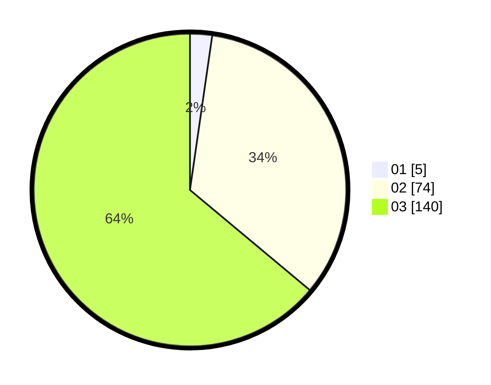

# Hasil

Hasil perolehan suara paslon dapat dilihat pada file paslon-01.txt, paslon-02.txt, dan paslon-03.txt.

Jika tidak ada, artinya data tersebut belum ada pada SIREKAP.

## Perolehan Suara

 * Paslon 01: **5**.
 * Paslon 02: **74**.
 * Paslon 03: **140**.

## Foto C Plano

https://sirekap-obj-formc.kpu.go.id/9979/pemilu/ppwp/31/73/06/10/05/3173061005204-20240214-203715--b28e0e2d-d1df-49e0-9e2c-9abf1734b5fe.jpg

https://sirekap-obj-formc.kpu.go.id/9979/pemilu/ppwp/31/73/06/10/05/3173061005204-20240214-203748--6db83d71-5791-4294-b6b0-01d9a7fec645.jpg

https://sirekap-obj-formc.kpu.go.id/9979/pemilu/ppwp/31/73/06/10/05/3173061005204-20240214-203837--3929a644-0c1b-4b55-bc3a-bbb889b454e8.jpg
