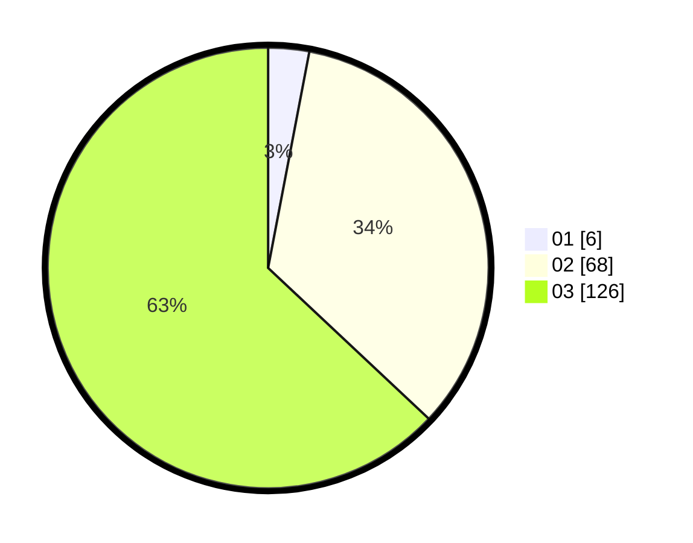

# Hasil

Hasil perolehan suara paslon dapat dilihat pada file paslon-01.txt, paslon-02.txt, dan paslon-03.txt.

Jika tidak ada, artinya data tersebut belum ada pada SIREKAP.

## Perolehan Suara

 * Paslon 01: **6**.
 * Paslon 02: **68**.
 * Paslon 03: **126**.

## Foto C Plano

https://sirekap-obj-formc.kpu.go.id/e467/pemilu/ppwp/31/73/06/10/05/3173061005206-20240214-155551--e311f9a1-424a-446a-9a79-2eeb5f5465ea.jpg

https://sirekap-obj-formc.kpu.go.id/e467/pemilu/ppwp/31/73/06/10/05/3173061005206-20240214-155453--c9c985c7-6d58-48bd-9df1-b123c2c3c43e.jpg

https://sirekap-obj-formc.kpu.go.id/e467/pemilu/ppwp/31/73/06/10/05/3173061005206-20240214-155640--33aeea59-f66e-4a2e-ab5a-3dc459dcb37e.jpg

## DATA PEMILIH TETAP

Jumlah pemilih dalam DPT: **256**.
 * L: **127**.
 * P: **129**.

## DATA PENGGUNA HAK PILIH

Jumlah pengguna hak pilih dalam DPT: **194**.
 * L: **95**.
 * P: **99**.

Jumlah pengguna hak pilih dalam DPTb: **5**.
 * L: **4**.
 * P: **1**.

Jumlah pengguna hak pilih dalam DPK: **1**.
 * L: **0**.
 * P: **1**.

Jumlah pengguna hak pilih: **200**.
 * L: **99**.
 * P: **101**.

## JUMLAH SUARA SAH DAN TIDAK SAH

JUMLAH SELURUH SUARA SAH: **200**.

JUMLAH SUARA TIDAK SAH: **0**.

JUMLAH SELURUH SUARA SAH DAN SUARA TIDAK SAH: **200**.
