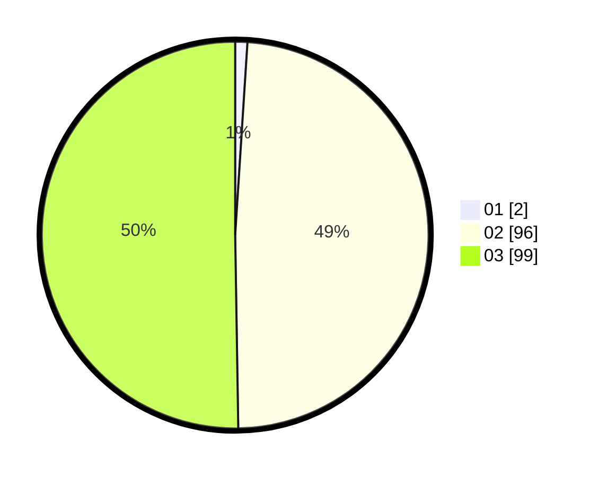

# Hasil

Hasil perolehan suara paslon dapat dilihat pada file paslon-01.txt, paslon-02.txt, dan paslon-03.txt.

Jika tidak ada, artinya data tersebut belum ada pada SIREKAP.

## Perolehan Suara

 * Paslon 01: **2**.
 * Paslon 02: **96**.
 * Paslon 03: **99**.

## Foto C Plano

https://sirekap-obj-formc.kpu.go.id/b6ed/pemilu/ppwp/31/73/06/10/05/3173061005208-20240214-193937--ef35e8f4-9416-4ad8-811b-d5aa6c13cc8a.jpg

https://sirekap-obj-formc.kpu.go.id/b6ed/pemilu/ppwp/31/73/06/10/05/3173061005208-20240214-194004--dbdaf7c5-7f37-4fac-b2f8-a3d3fe329b7d.jpg

https://sirekap-obj-formc.kpu.go.id/b6ed/pemilu/ppwp/31/73/06/10/05/3173061005208-20240214-194025--51d78c49-0c22-4d53-9c9d-04e6e1f3b1c4.jpg

## DATA PEMILIH TETAP

Jumlah pemilih dalam DPT: **257**.
 * L: **127**.
 * P: **130**.

## DATA PENGGUNA HAK PILIH

Jumlah pengguna hak pilih dalam DPT: **178**.
 * L: **85**.
 * P: **93**.

Jumlah pengguna hak pilih dalam DPTb: **7**.
 * L: **1**.
 * P: **6**.

Jumlah pengguna hak pilih dalam DPK: **15**.
 * L: **7**.
 * P: **8**.

Jumlah pengguna hak pilih: **200**.
 * L: **93**.
 * P: **107**.

## JUMLAH SUARA SAH DAN TIDAK SAH

JUMLAH SELURUH SUARA SAH: **197**.

JUMLAH SUARA TIDAK SAH: **3**.

JUMLAH SELURUH SUARA SAH DAN SUARA TIDAK SAH: **200**.
