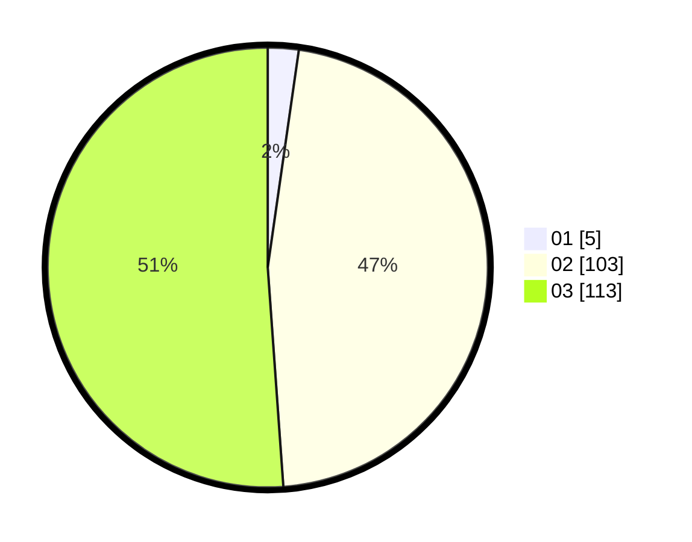

# Hasil

Hasil perolehan suara paslon dapat dilihat pada file paslon-01.txt, paslon-02.txt, dan paslon-03.txt.

Jika tidak ada, artinya data tersebut belum ada pada SIREKAP.

## Perolehan Suara

 * Paslon 01: **5**.
 * Paslon 02: **103**.
 * Paslon 03: **113**.

## Foto C Plano

https://sirekap-obj-formc.kpu.go.id/c2ee/pemilu/ppwp/31/73/06/10/05/3173061005210-20240214-200039--059cb602-35a7-4aeb-a9b5-2f4c0270fb88.jpg

https://sirekap-obj-formc.kpu.go.id/c2ee/pemilu/ppwp/31/73/06/10/05/3173061005210-20240214-200053--4e07f4e6-af5c-4c3c-80ff-506ff4e7bd4d.jpg

https://sirekap-obj-formc.kpu.go.id/c2ee/pemilu/ppwp/31/73/06/10/05/3173061005210-20240214-200107--5f2ed58f-3f8b-47cd-921b-9afedbbf491c.jpg

## DATA PEMILIH TETAP

Jumlah pemilih dalam DPT: **260**.
 * L: **115**.
 * P: **145**.

## DATA PENGGUNA HAK PILIH

Jumlah pengguna hak pilih dalam DPT: **215**.
 * L: **97**.
 * P: **118**.

Jumlah pengguna hak pilih dalam DPTb: **3**.
 * L: **1**.
 * P: **2**.

Jumlah pengguna hak pilih dalam DPK: **6**.
 * L: **3**.
 * P: **3**.

Jumlah pengguna hak pilih: **224**.
 * L: **101**.
 * P: **123**.

## JUMLAH SUARA SAH DAN TIDAK SAH

JUMLAH SELURUH SUARA SAH: **221**.

JUMLAH SUARA TIDAK SAH: **3**.

JUMLAH SELURUH SUARA SAH DAN SUARA TIDAK SAH: **224**.
