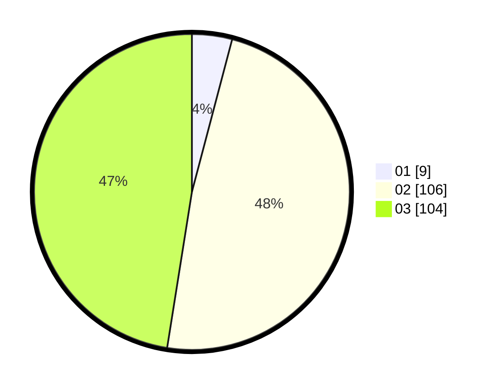

# Hasil

Hasil perolehan suara paslon dapat dilihat pada file paslon-01.txt, paslon-02.txt, dan paslon-03.txt.

Jika tidak ada, artinya data tersebut belum ada pada SIREKAP.

## Perolehan Suara

 * Paslon 01: **9**.
 * Paslon 02: **106**.
 * Paslon 03: **104**.

## Foto C Plano

https://sirekap-obj-formc.kpu.go.id/4269/pemilu/ppwp/31/73/06/10/05/3173061005211-20240214-155042--4e768255-5fac-4972-bc29-803849e694b8.jpg

https://sirekap-obj-formc.kpu.go.id/4269/pemilu/ppwp/31/73/06/10/05/3173061005211-20240214-193143--9be2e51e-554d-4a1b-8b61-5f772e8f66fe.jpg

https://sirekap-obj-formc.kpu.go.id/4269/pemilu/ppwp/31/73/06/10/05/3173061005211-20240214-193217--5fbe7714-a6f5-4bea-b071-c9e5da71807f.jpg

## DATA PEMILIH TETAP

Jumlah pemilih dalam DPT: **289**.
 * L: **140**.
 * P: **149**.

## DATA PENGGUNA HAK PILIH

Jumlah pengguna hak pilih dalam DPT: **216**.
 * L: **104**.
 * P: **112**.

Jumlah pengguna hak pilih dalam DPTb: **3**.
 * L: **2**.
 * P: **1**.

Jumlah pengguna hak pilih dalam DPK: **2**.
 * L: **0**.
 * P: **2**.

Jumlah pengguna hak pilih: **221**.
 * L: **106**.
 * P: **115**.

## JUMLAH SUARA SAH DAN TIDAK SAH

JUMLAH SELURUH SUARA SAH: **219**.

JUMLAH SUARA TIDAK SAH: **2**.

JUMLAH SELURUH SUARA SAH DAN SUARA TIDAK SAH: **221**.
