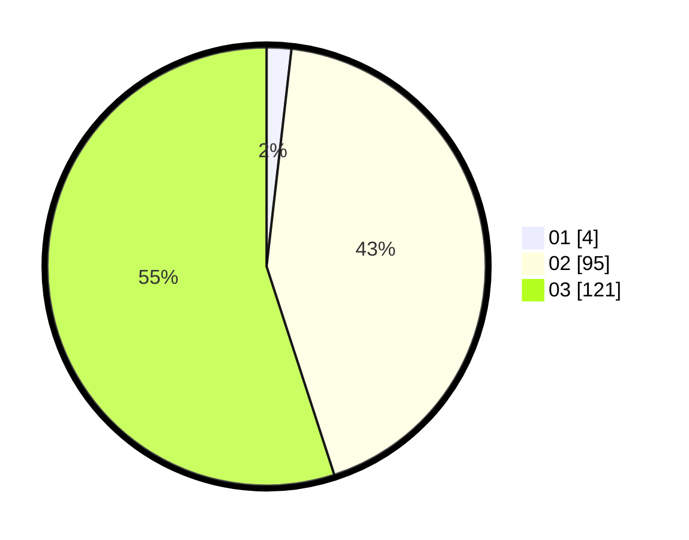

# Hasil

Hasil perolehan suara paslon dapat dilihat pada file paslon-01.txt, paslon-02.txt, dan paslon-03.txt.

Jika tidak ada, artinya data tersebut belum ada pada SIREKAP.

## Perolehan Suara

 * Paslon 01: **4**.
 * Paslon 02: **95**.
 * Paslon 03: **121**.

## Foto C Plano

https://sirekap-obj-formc.kpu.go.id/02ec/pemilu/ppwp/31/73/06/10/05/3173061005213-20240214-192953--9ce160da-ff22-4953-a637-4127bfcfdd03.jpg

https://sirekap-obj-formc.kpu.go.id/02ec/pemilu/ppwp/31/73/06/10/05/3173061005213-20240214-193035--1a3ca406-b246-46de-adee-0a9a51328cdb.jpg

https://sirekap-obj-formc.kpu.go.id/02ec/pemilu/ppwp/31/73/06/10/05/3173061005213-20240214-193058--b5c96dbc-8cb0-4dce-9500-c157df11e75b.jpg

## DATA PEMILIH TETAP

Jumlah pemilih dalam DPT: **299**.
 * L: **134**.
 * P: **165**.

## DATA PENGGUNA HAK PILIH

Jumlah pengguna hak pilih dalam DPT: **218**.
 * L: **101**.
 * P: **117**.

Jumlah pengguna hak pilih dalam DPTb: **0**.
 * L: **0**.
 * P: **0**.

Jumlah pengguna hak pilih dalam DPK: **4**.
 * L: **3**.
 * P: **1**.

Jumlah pengguna hak pilih: **222**.
 * L: **104**.
 * P: **118**.

## JUMLAH SUARA SAH DAN TIDAK SAH

JUMLAH SELURUH SUARA SAH: **220**.

JUMLAH SUARA TIDAK SAH: **2**.

JUMLAH SELURUH SUARA SAH DAN SUARA TIDAK SAH: **222**.
