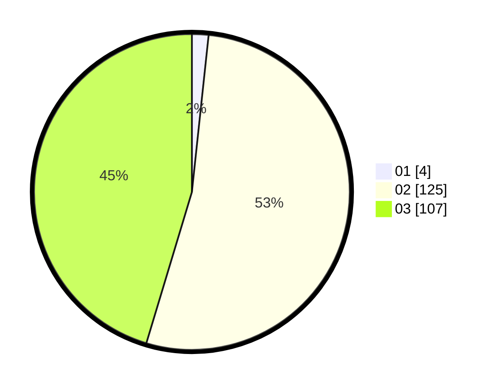

# Hasil

Hasil perolehan suara paslon dapat dilihat pada file paslon-01.txt, paslon-02.txt, dan paslon-03.txt.

Jika tidak ada, artinya data tersebut belum ada pada SIREKAP.

## Perolehan Suara

 * Paslon 01: **4**.
 * Paslon 02: **125**.
 * Paslon 03: **107**.

## Foto C Plano

https://sirekap-obj-formc.kpu.go.id/8f21/pemilu/ppwp/31/73/06/10/05/3173061005214-20240216-221644--d2e051f0-1e6f-4769-ab1e-465572c93119.jpg

https://sirekap-obj-formc.kpu.go.id/8f21/pemilu/ppwp/31/73/06/10/05/3173061005214-20240216-221732--657ffe56-31d4-4f92-b312-660edb955094.jpg

https://sirekap-obj-formc.kpu.go.id/8f21/pemilu/ppwp/31/73/06/10/05/3173061005214-20240216-221814--ab520175-a98e-4ee5-97d5-ca7f0e65525d.jpg
