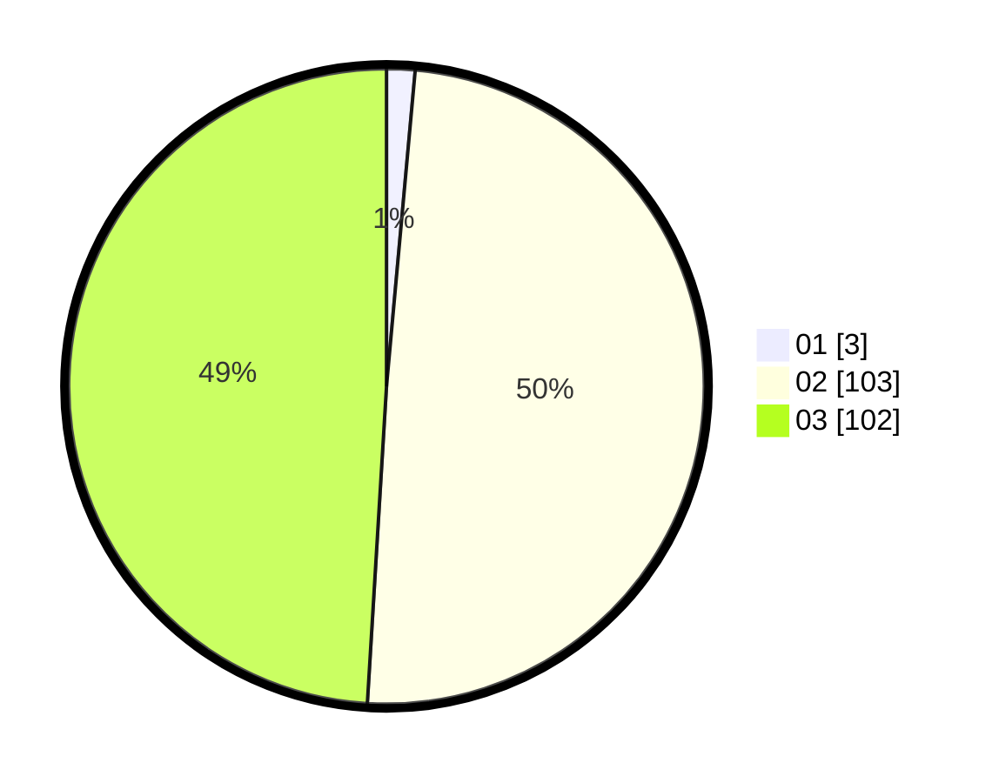

# Hasil

Hasil perolehan suara paslon dapat dilihat pada file paslon-01.txt, paslon-02.txt, dan paslon-03.txt.

Jika tidak ada, artinya data tersebut belum ada pada SIREKAP.

## Perolehan Suara

 * Paslon 01: **3**.
 * Paslon 02: **103**.
 * Paslon 03: **102**.

## Foto C Plano

https://sirekap-obj-formc.kpu.go.id/64ca/pemilu/ppwp/31/73/06/10/05/3173061005216-20240214-195930--d33f5f74-9242-43a8-8372-1eea95e3edcc.jpg

https://sirekap-obj-formc.kpu.go.id/64ca/pemilu/ppwp/31/73/06/10/05/3173061005216-20240214-200224--a5f63b5e-84eb-4656-a767-eae48119b36c.jpg

https://sirekap-obj-formc.kpu.go.id/64ca/pemilu/ppwp/31/73/06/10/05/3173061005216-20240214-200340--6092aa24-df7a-49b8-86a5-2b5224912f7f.jpg
