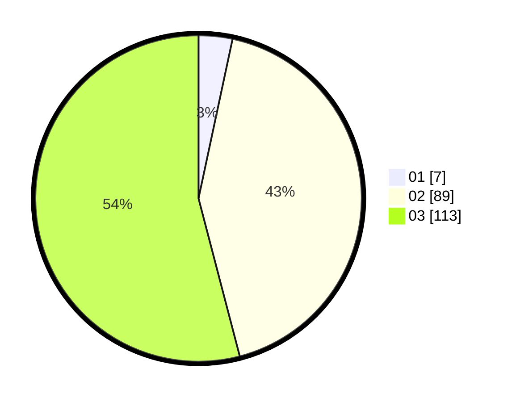

# Hasil

Hasil perolehan suara paslon dapat dilihat pada file paslon-01.txt, paslon-02.txt, dan paslon-03.txt.

Jika tidak ada, artinya data tersebut belum ada pada SIREKAP.

## Perolehan Suara

 * Paslon 01: **7**.
 * Paslon 02: **89**.
 * Paslon 03: **113**.

## Foto C Plano

https://sirekap-obj-formc.kpu.go.id/81bd/pemilu/ppwp/31/73/06/10/05/3173061005217-20240214-203110--5c239ccf-1e53-411d-baa8-9ad2099805ad.jpg

https://sirekap-obj-formc.kpu.go.id/81bd/pemilu/ppwp/31/73/06/10/05/3173061005217-20240214-203203--492c1b39-df56-4b84-9d10-f7bf4ff09a63.jpg

https://sirekap-obj-formc.kpu.go.id/81bd/pemilu/ppwp/31/73/06/10/05/3173061005217-20240214-203313--9067bcb1-c105-4225-9f58-8fea0a205865.jpg
