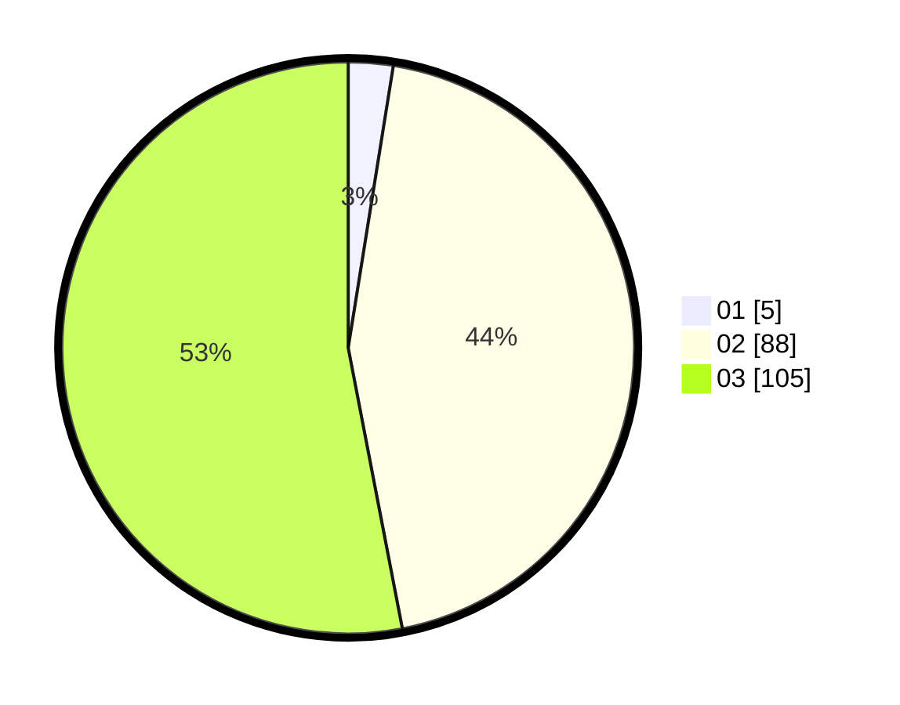

# Hasil

Hasil perolehan suara paslon dapat dilihat pada file paslon-01.txt, paslon-02.txt, dan paslon-03.txt.

Jika tidak ada, artinya data tersebut belum ada pada SIREKAP.

## Perolehan Suara

 * Paslon 01: **5**.
 * Paslon 02: **88**.
 * Paslon 03: **105**.

## Foto C Plano

https://sirekap-obj-formc.kpu.go.id/40b9/pemilu/ppwp/31/73/06/10/05/3173061005223-20240214-213937--8d21419f-1325-403b-8acb-fa1c80b598b1.jpg

https://sirekap-obj-formc.kpu.go.id/40b9/pemilu/ppwp/31/73/06/10/05/3173061005223-20240214-214023--35b657e2-cb69-41ec-8689-d117e1e8338c.jpg

https://sirekap-obj-formc.kpu.go.id/40b9/pemilu/ppwp/31/73/06/10/05/3173061005223-20240214-214105--b2cccbd4-f243-44e7-9652-314c0288b1a2.jpg
