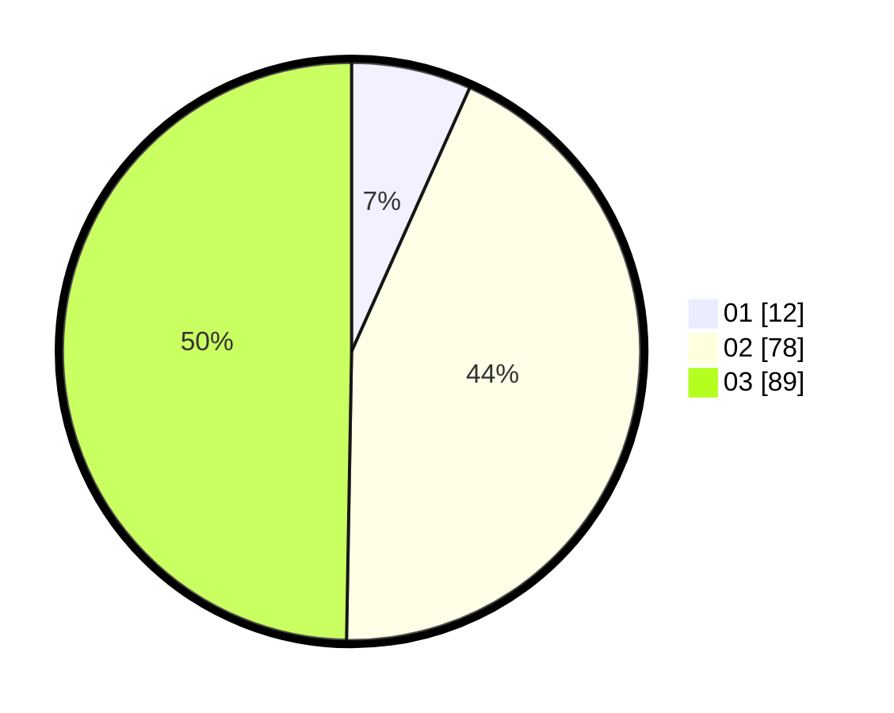

# Hasil

Hasil perolehan suara paslon dapat dilihat pada file paslon-01.txt, paslon-02.txt, dan paslon-03.txt.

Jika tidak ada, artinya data tersebut belum ada pada SIREKAP.

## Perolehan Suara

 * Paslon 01: **12**.
 * Paslon 02: **78**.
 * Paslon 03: **89**.

## Foto C Plano

https://sirekap-obj-formc.kpu.go.id/35e5/pemilu/ppwp/31/73/06/10/05/3173061005224-20240214-201536--c8a86d7c-29c4-4450-ad3f-9bccdc9db8cb.jpg

https://sirekap-obj-formc.kpu.go.id/35e5/pemilu/ppwp/31/73/06/10/05/3173061005224-20240214-201541--511c63f4-a2e1-4278-a508-fdd63620f32e.jpg

https://sirekap-obj-formc.kpu.go.id/35e5/pemilu/ppwp/31/73/06/10/05/3173061005224-20240214-201545--56058991-2235-4e0e-9cea-c1c324383966.jpg

## DATA PEMILIH TETAP

Jumlah pemilih dalam DPT: **240**.
 * L: **111**.
 * P: **129**.

## DATA PENGGUNA HAK PILIH

Jumlah pengguna hak pilih dalam DPT: **178**.
 * L: **83**.
 * P: **95**.

Jumlah pengguna hak pilih dalam DPTb: **3**.
 * L: **2**.
 * P: **1**.

Jumlah pengguna hak pilih dalam DPK: **0**.
 * L: **0**.
 * P: **0**.

Jumlah pengguna hak pilih: **181**.
 * L: **85**.
 * P: **96**.

## JUMLAH SUARA SAH DAN TIDAK SAH

JUMLAH SELURUH SUARA SAH: **179**.

JUMLAH SUARA TIDAK SAH: **2**.

JUMLAH SELURUH SUARA SAH DAN SUARA TIDAK SAH: **181**.
