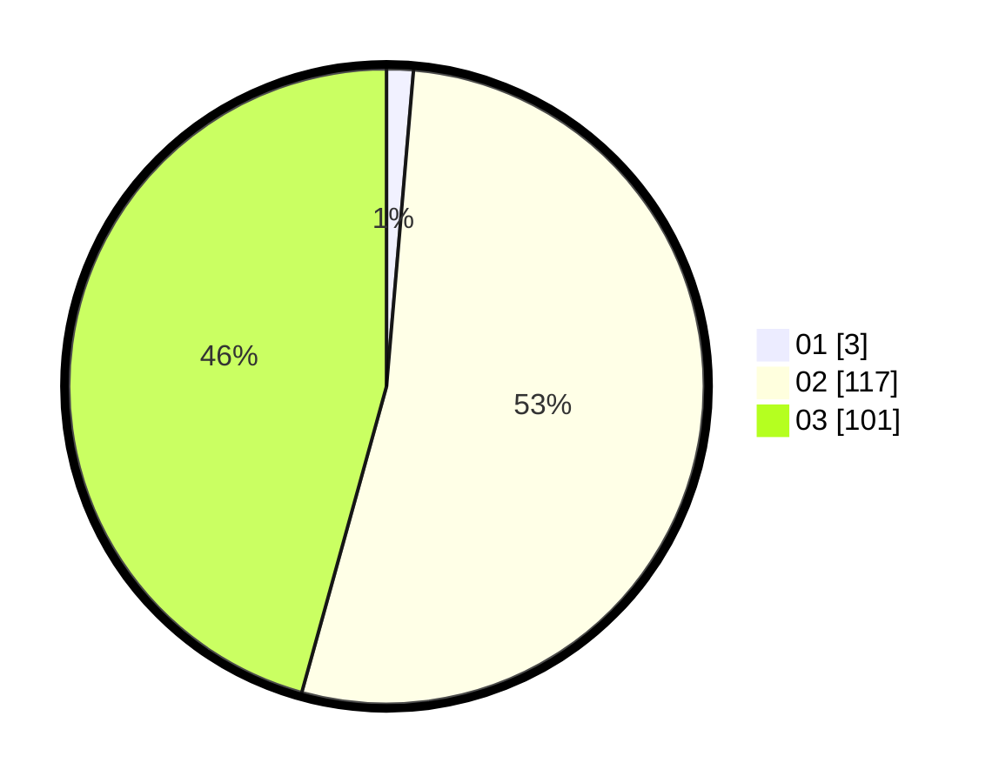

# Hasil

Hasil perolehan suara paslon dapat dilihat pada file paslon-01.txt, paslon-02.txt, dan paslon-03.txt.

Jika tidak ada, artinya data tersebut belum ada pada SIREKAP.

## Perolehan Suara

 * Paslon 01: **3**.
 * Paslon 02: **117**.
 * Paslon 03: **101**.

## Foto C Plano

https://sirekap-obj-formc.kpu.go.id/37bc/pemilu/ppwp/31/73/06/10/05/3173061005226-20240215-231110--c4bff84c-b13a-4790-8585-d4946b0ea6d3.jpg

https://sirekap-obj-formc.kpu.go.id/37bc/pemilu/ppwp/31/73/06/10/05/3173061005226-20240215-231111--77ca8090-d013-488d-a56d-9e9d88fa271a.jpg

https://sirekap-obj-formc.kpu.go.id/37bc/pemilu/ppwp/31/73/06/10/05/3173061005226-20240215-231110--e39b9e6e-c1da-46a5-bf62-a37ee57c21a1.jpg

## DATA PEMILIH TETAP

Jumlah pemilih dalam DPT: **224**.
 * L: **110**.
 * P: **114**.

## DATA PENGGUNA HAK PILIH

Jumlah pengguna hak pilih dalam DPT: **223**.
 * L: **110**.
 * P: **113**.

Jumlah pengguna hak pilih dalam DPTb: **1**.
 * L: **0**.
 * P: **1**.

Jumlah pengguna hak pilih dalam DPK: **0**.
 * L: **0**.
 * P: **0**.

Jumlah pengguna hak pilih: **224**.
 * L: **110**.
 * P: **114**.

## JUMLAH SUARA SAH DAN TIDAK SAH

JUMLAH SELURUH SUARA SAH: **221**.

JUMLAH SUARA TIDAK SAH: **3**.

JUMLAH SELURUH SUARA SAH DAN SUARA TIDAK SAH: **224**.
