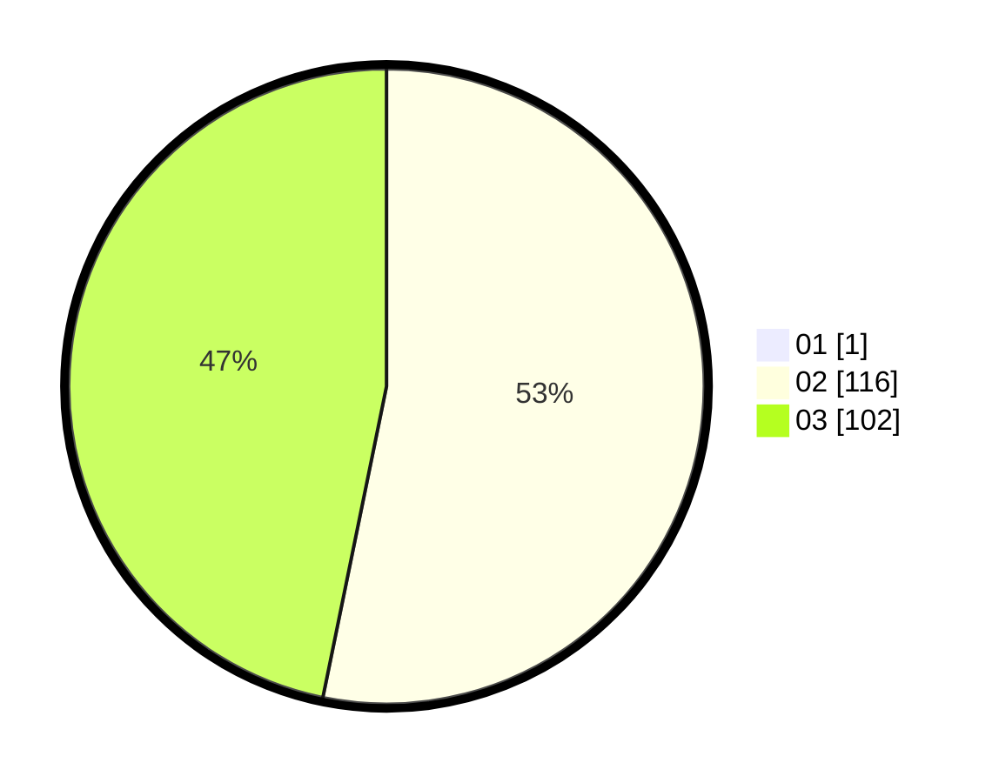

# Hasil

Hasil perolehan suara paslon dapat dilihat pada file paslon-01.txt, paslon-02.txt, dan paslon-03.txt.

Jika tidak ada, artinya data tersebut belum ada pada SIREKAP.

## Perolehan Suara

 * Paslon 01: **1**.
 * Paslon 02: **116**.
 * Paslon 03: **102**.

## Foto C Plano

https://sirekap-obj-formc.kpu.go.id/90f9/pemilu/ppwp/31/73/06/10/05/3173061005233-20240214-175446--cd73e165-85e5-40c1-b757-01f706d15924.jpg

https://sirekap-obj-formc.kpu.go.id/90f9/pemilu/ppwp/31/73/06/10/05/3173061005233-20240214-155801--5544efdc-2f78-4a4a-a2da-d70061efb636.jpg

https://sirekap-obj-formc.kpu.go.id/90f9/pemilu/ppwp/31/73/06/10/05/3173061005233-20240214-175444--59a69561-afc9-435a-a3b7-09f197e6e100.jpg

## DATA PEMILIH TETAP

Jumlah pemilih dalam DPT: **288**.
 * L: **132**.
 * P: **156**.

## DATA PENGGUNA HAK PILIH

Jumlah pengguna hak pilih dalam DPT: **211**.
 * L: **93**.
 * P: **118**.

Jumlah pengguna hak pilih dalam DPTb: **3**.
 * L: **0**.
 * P: **3**.

Jumlah pengguna hak pilih dalam DPK: **7**.
 * L: **3**.
 * P: **4**.

Jumlah pengguna hak pilih: **221**.
 * L: **96**.
 * P: **125**.

## JUMLAH SUARA SAH DAN TIDAK SAH

JUMLAH SELURUH SUARA SAH: **219**.

JUMLAH SUARA TIDAK SAH: **2**.

JUMLAH SELURUH SUARA SAH DAN SUARA TIDAK SAH: **221**.
