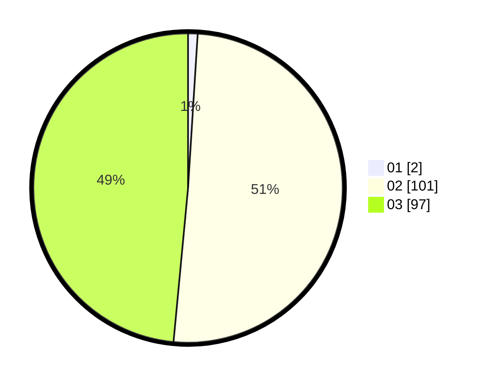

# Hasil

Hasil perolehan suara paslon dapat dilihat pada file paslon-01.txt, paslon-02.txt, dan paslon-03.txt.

Jika tidak ada, artinya data tersebut belum ada pada SIREKAP.

## Perolehan Suara

 * Paslon 01: **2**.
 * Paslon 02: **101**.
 * Paslon 03: **97**.

## Foto C Plano

https://sirekap-obj-formc.kpu.go.id/801c/pemilu/ppwp/31/73/06/10/05/3173061005234-20240214-215845--8997ff86-c9df-4590-838f-f60e16daa3c8.jpg

https://sirekap-obj-formc.kpu.go.id/801c/pemilu/ppwp/31/73/06/10/05/3173061005234-20240214-204508--38c00664-a0cd-43ee-a31a-9e69a81109ee.jpg

https://sirekap-obj-formc.kpu.go.id/801c/pemilu/ppwp/31/73/06/10/05/3173061005234-20240214-204524--247d6227-8f65-4a5e-8c85-2dd2e96fb56f.jpg
