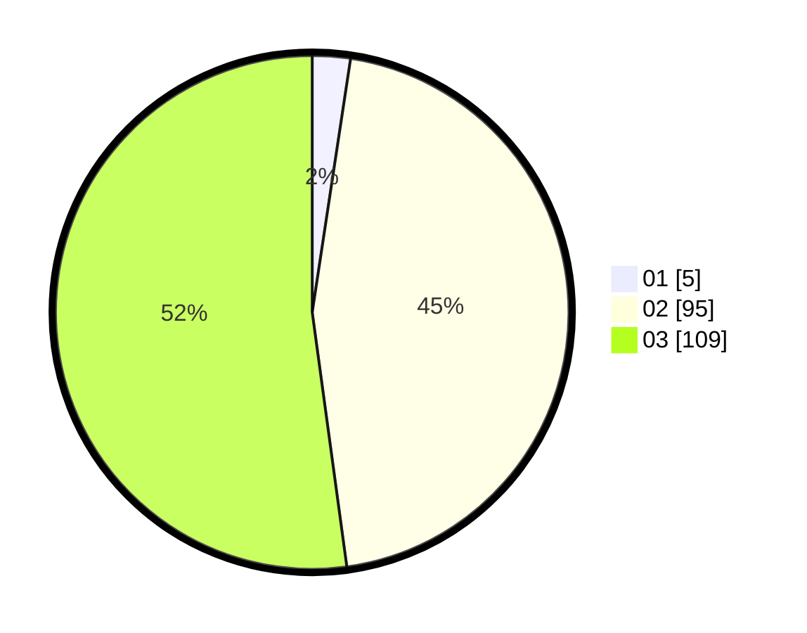

# Hasil

Hasil perolehan suara paslon dapat dilihat pada file paslon-01.txt, paslon-02.txt, dan paslon-03.txt.

Jika tidak ada, artinya data tersebut belum ada pada SIREKAP.

## Perolehan Suara

 * Paslon 01: **5**.
 * Paslon 02: **95**.
 * Paslon 03: **109**.

## Foto C Plano

https://sirekap-obj-formc.kpu.go.id/5eae/pemilu/ppwp/31/73/06/10/05/3173061005235-20240215-105354--fbdf17ca-d2db-4751-8337-fee7d31633f8.jpg

https://sirekap-obj-formc.kpu.go.id/5eae/pemilu/ppwp/31/73/06/10/05/3173061005235-20240215-105403--61faa68b-26fe-4113-b1cc-89b25edefbea.jpg

https://sirekap-obj-formc.kpu.go.id/5eae/pemilu/ppwp/31/73/06/10/05/3173061005235-20240215-105412--3d781210-ca5d-4b66-9584-b8041d696f62.jpg

## DATA PEMILIH TETAP

Jumlah pemilih dalam DPT: **269**.
 * L: **134**.
 * P: **135**.

## DATA PENGGUNA HAK PILIH

Jumlah pengguna hak pilih dalam DPT: **199**.
 * L: **98**.
 * P: **101**.

Jumlah pengguna hak pilih dalam DPTb: **4**.
 * L: **2**.
 * P: **2**.

Jumlah pengguna hak pilih dalam DPK: **6**.
 * L: **3**.
 * P: **3**.

Jumlah pengguna hak pilih: **209**.
 * L: **103**.
 * P: **106**.

## JUMLAH SUARA SAH DAN TIDAK SAH

JUMLAH SELURUH SUARA SAH: **209**.

JUMLAH SUARA TIDAK SAH: **1**.

JUMLAH SELURUH SUARA SAH DAN SUARA TIDAK SAH: **210**.
