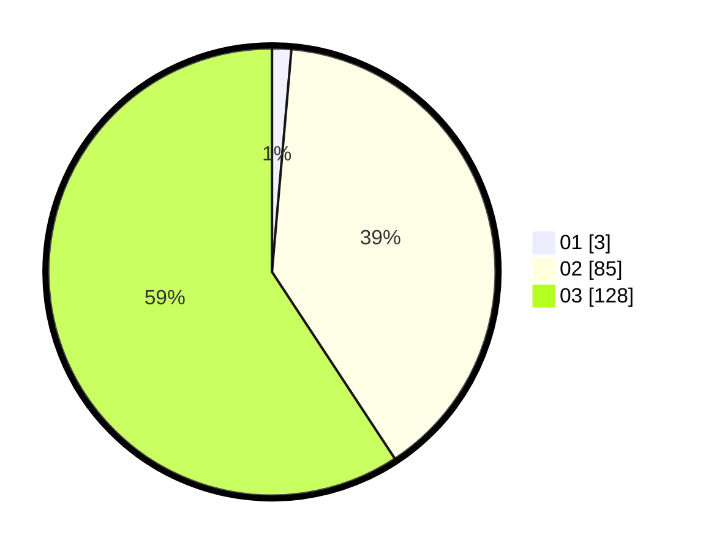

# Hasil

Hasil perolehan suara paslon dapat dilihat pada file paslon-01.txt, paslon-02.txt, dan paslon-03.txt.

Jika tidak ada, artinya data tersebut belum ada pada SIREKAP.

## Perolehan Suara

 * Paslon 01: **3**.
 * Paslon 02: **85**.
 * Paslon 03: **128**.

## Foto C Plano

https://sirekap-obj-formc.kpu.go.id/c091/pemilu/ppwp/31/73/06/10/05/3173061005236-20240214-155135--27aa65b6-7dc8-49ed-bfe5-13319f7a13ee.jpg

https://sirekap-obj-formc.kpu.go.id/c091/pemilu/ppwp/31/73/06/10/05/3173061005236-20240214-155631--c9ef8c34-90de-4bb2-8d37-6c2fa3feb9e8.jpg

https://sirekap-obj-formc.kpu.go.id/c091/pemilu/ppwp/31/73/06/10/05/3173061005236-20240214-160104--24905c0a-ea43-4bcd-9198-4a3f440ff348.jpg

## DATA PEMILIH TETAP

Jumlah pemilih dalam DPT: **296**.
 * L: **141**.
 * P: **155**.

## DATA PENGGUNA HAK PILIH

Jumlah pengguna hak pilih dalam DPT: **214**.
 * L: **103**.
 * P: **111**.

Jumlah pengguna hak pilih dalam DPTb: **4**.
 * L: **1**.
 * P: **3**.

Jumlah pengguna hak pilih dalam DPK: **4**.
 * L: **2**.
 * P: **2**.

Jumlah pengguna hak pilih: **222**.
 * L: **106**.
 * P: **116**.

## JUMLAH SUARA SAH DAN TIDAK SAH

JUMLAH SELURUH SUARA SAH: **216**.

JUMLAH SUARA TIDAK SAH: **6**.

JUMLAH SELURUH SUARA SAH DAN SUARA TIDAK SAH: **222**.
