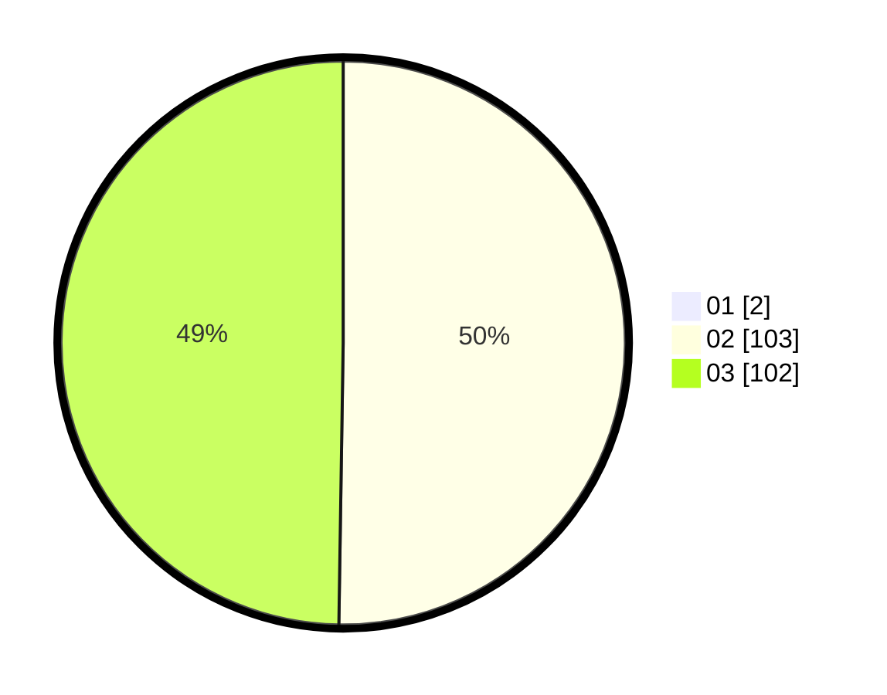

# Hasil

Hasil perolehan suara paslon dapat dilihat pada file paslon-01.txt, paslon-02.txt, dan paslon-03.txt.

Jika tidak ada, artinya data tersebut belum ada pada SIREKAP.

## Perolehan Suara

 * Paslon 01: **2**.
 * Paslon 02: **103**.
 * Paslon 03: **102**.

## Foto C Plano

https://sirekap-obj-formc.kpu.go.id/34b3/pemilu/ppwp/31/73/06/10/05/3173061005237-20240214-204029--fe534b8a-8c1e-4298-97e6-85279bcb321a.jpg

https://sirekap-obj-formc.kpu.go.id/34b3/pemilu/ppwp/31/73/06/10/05/3173061005237-20240214-204109--62885239-a15d-40bb-a752-f1dfeff94994.jpg

https://sirekap-obj-formc.kpu.go.id/34b3/pemilu/ppwp/31/73/06/10/05/3173061005237-20240214-204308--e29545eb-70c2-4cf8-8b25-616c5729105f.jpg

## DATA PEMILIH TETAP

Jumlah pemilih dalam DPT: **286**.
 * L: **137**.
 * P: **149**.

## DATA PENGGUNA HAK PILIH

Jumlah pengguna hak pilih dalam DPT: **199**.
 * L: **94**.
 * P: **105**.

Jumlah pengguna hak pilih dalam DPTb: **5**.
 * L: **3**.
 * P: **2**.

Jumlah pengguna hak pilih dalam DPK: **3**.
 * L: **3**.
 * P: **0**.

Jumlah pengguna hak pilih: **207**.
 * L: **100**.
 * P: **107**.

## JUMLAH SUARA SAH DAN TIDAK SAH

JUMLAH SELURUH SUARA SAH: **207**.

JUMLAH SUARA TIDAK SAH: **0**.

JUMLAH SELURUH SUARA SAH DAN SUARA TIDAK SAH: **207**.
