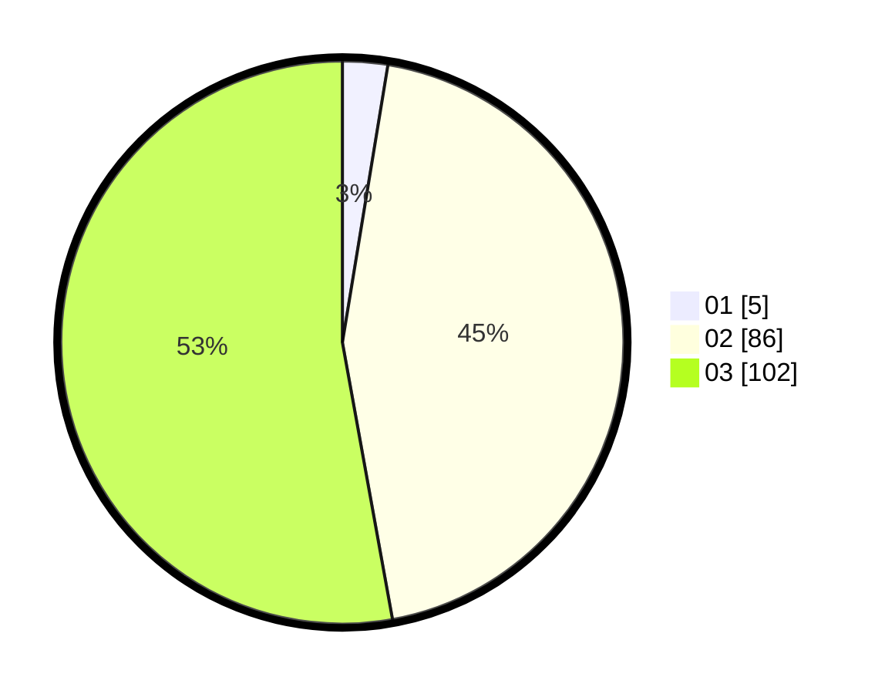

# Hasil

Hasil perolehan suara paslon dapat dilihat pada file paslon-01.txt, paslon-02.txt, dan paslon-03.txt.

Jika tidak ada, artinya data tersebut belum ada pada SIREKAP.

## Perolehan Suara

 * Paslon 01: **5**.
 * Paslon 02: **86**.
 * Paslon 03: **102**.

## Foto C Plano

https://sirekap-obj-formc.kpu.go.id/1848/pemilu/ppwp/31/73/06/10/05/3173061005238-20240214-213405--44676131-e3c7-4964-b3e4-c91a9fe72961.jpg

https://sirekap-obj-formc.kpu.go.id/1848/pemilu/ppwp/31/73/06/10/05/3173061005238-20240214-213520--d51db6ae-21f7-474a-b267-463d870c6846.jpg

https://sirekap-obj-formc.kpu.go.id/1848/pemilu/ppwp/31/73/06/10/05/3173061005238-20240214-213610--32838ba1-8a96-49d5-9d11-b55b9148e618.jpg

## DATA PEMILIH TETAP

Jumlah pemilih dalam DPT: **246**.
 * L: **117**.
 * P: **129**.

## DATA PENGGUNA HAK PILIH

Jumlah pengguna hak pilih dalam DPT: **186**.
 * L: **88**.
 * P: **98**.

Jumlah pengguna hak pilih dalam DPTb: **6**.
 * L: **3**.
 * P: **3**.

Jumlah pengguna hak pilih dalam DPK: **3**.
 * L: **1**.
 * P: **2**.

Jumlah pengguna hak pilih: **195**.
 * L: **92**.
 * P: **103**.

## JUMLAH SUARA SAH DAN TIDAK SAH

JUMLAH SELURUH SUARA SAH: **193**.

JUMLAH SUARA TIDAK SAH: **2**.

JUMLAH SELURUH SUARA SAH DAN SUARA TIDAK SAH: **195**.
