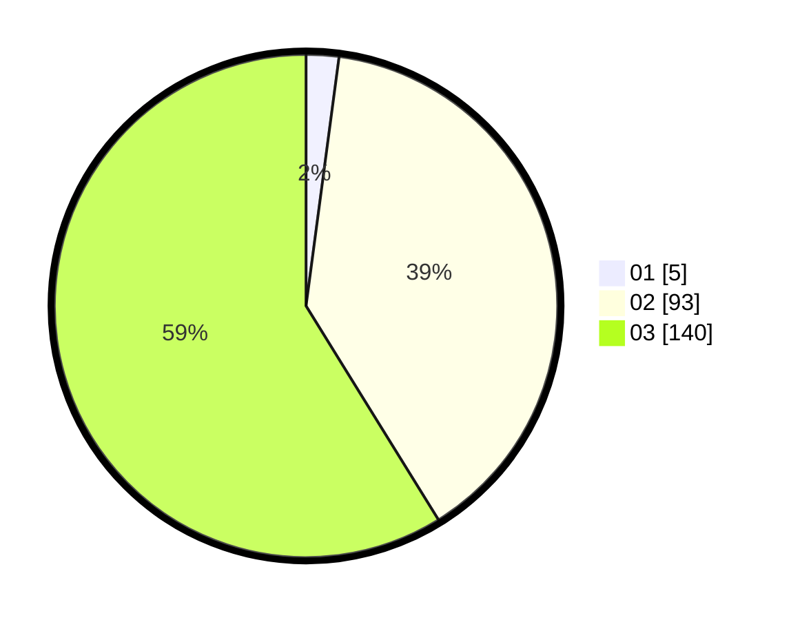

# Hasil

Hasil perolehan suara paslon dapat dilihat pada file paslon-01.txt, paslon-02.txt, dan paslon-03.txt.

Jika tidak ada, artinya data tersebut belum ada pada SIREKAP.

## Perolehan Suara

 * Paslon 01: **5**.
 * Paslon 02: **93**.
 * Paslon 03: **140**.

## Foto C Plano

https://sirekap-obj-formc.kpu.go.id/a44c/pemilu/ppwp/31/73/06/10/05/3173061005240-20240214-200436--43d8dae5-1bf2-4a5d-a402-2e2fea97e43a.jpg

https://sirekap-obj-formc.kpu.go.id/a44c/pemilu/ppwp/31/73/06/10/05/3173061005240-20240214-193431--7f6c6399-27f0-4a1e-9e5c-704d840e609c.jpg

https://sirekap-obj-formc.kpu.go.id/a44c/pemilu/ppwp/31/73/06/10/05/3173061005240-20240214-193516--4b340dcc-81b1-46fe-a533-659ad974c421.jpg

## DATA PEMILIH TETAP

Jumlah pemilih dalam DPT: **272**.
 * L: **126**.
 * P: **146**.

## DATA PENGGUNA HAK PILIH

Jumlah pengguna hak pilih dalam DPT: **228**.
 * L: **106**.
 * P: **122**.

Jumlah pengguna hak pilih dalam DPTb: **8**.
 * L: **3**.
 * P: **5**.

Jumlah pengguna hak pilih dalam DPK: **4**.
 * L: **2**.
 * P: **2**.

Jumlah pengguna hak pilih: **240**.
 * L: **111**.
 * P: **129**.

## JUMLAH SUARA SAH DAN TIDAK SAH

JUMLAH SELURUH SUARA SAH: **238**.

JUMLAH SUARA TIDAK SAH: **2**.

JUMLAH SELURUH SUARA SAH DAN SUARA TIDAK SAH: **240**.
