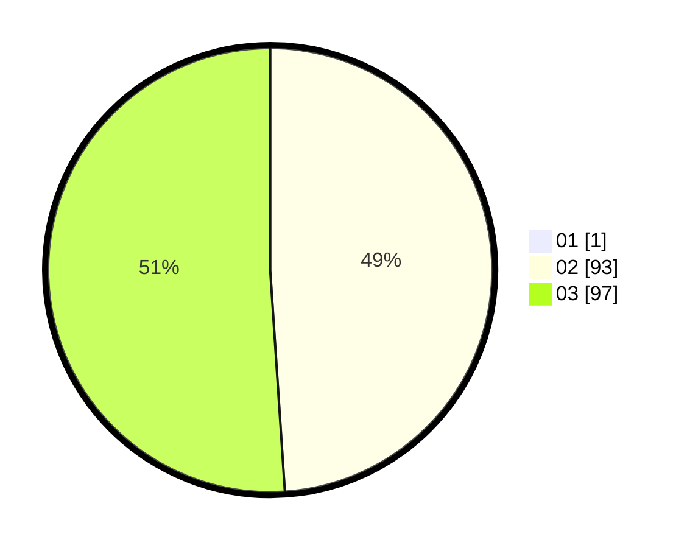

# Hasil

Hasil perolehan suara paslon dapat dilihat pada file paslon-01.txt, paslon-02.txt, dan paslon-03.txt.

Jika tidak ada, artinya data tersebut belum ada pada SIREKAP.

## Perolehan Suara

 * Paslon 01: **1**.
 * Paslon 02: **93**.
 * Paslon 03: **97**.

## Foto C Plano

https://sirekap-obj-formc.kpu.go.id/9cde/pemilu/ppwp/31/73/06/10/05/3173061005241-20240215-124713--d583284c-8a57-438b-95f3-ba1d73efd1c6.jpg

https://sirekap-obj-formc.kpu.go.id/9cde/pemilu/ppwp/31/73/06/10/05/3173061005241-20240214-201201--d0fb312d-b100-42b3-b11f-f86f6abe2753.jpg

https://sirekap-obj-formc.kpu.go.id/9cde/pemilu/ppwp/31/73/06/10/05/3173061005241-20240214-201258--188e36ef-d702-4146-b83b-39e1d229d86c.jpg
