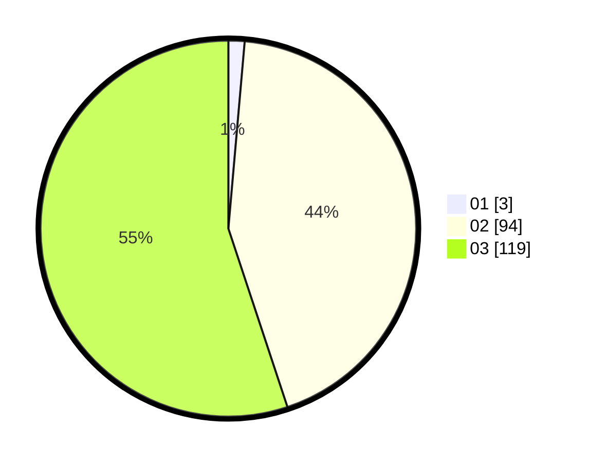

# Hasil

Hasil perolehan suara paslon dapat dilihat pada file paslon-01.txt, paslon-02.txt, dan paslon-03.txt.

Jika tidak ada, artinya data tersebut belum ada pada SIREKAP.

## Perolehan Suara

 * Paslon 01: **3**.
 * Paslon 02: **94**.
 * Paslon 03: **119**.

## Foto C Plano

https://sirekap-obj-formc.kpu.go.id/0890/pemilu/ppwp/31/73/06/10/05/3173061005243-20240214-191851--a3aa50c7-6306-41dd-82dd-95a9d0e5b24d.jpg

https://sirekap-obj-formc.kpu.go.id/0890/pemilu/ppwp/31/73/06/10/05/3173061005243-20240214-191955--b54e05af-ab66-4751-be56-030416ee39d0.jpg

https://sirekap-obj-formc.kpu.go.id/0890/pemilu/ppwp/31/73/06/10/05/3173061005243-20240214-192049--ae339ae8-b167-48b6-a468-488c4486205f.jpg

## DATA PEMILIH TETAP

Jumlah pemilih dalam DPT: **282**.
 * L: **130**.
 * P: **152**.

## DATA PENGGUNA HAK PILIH

Jumlah pengguna hak pilih dalam DPT: **218**.
 * L: **96**.
 * P: **122**.

Jumlah pengguna hak pilih dalam DPTb: **0**.
 * L: **0**.
 * P: **0**.

Jumlah pengguna hak pilih dalam DPK: **0**.
 * L: **0**.
 * P: **0**.

Jumlah pengguna hak pilih: **218**.
 * L: **96**.
 * P: **122**.

## JUMLAH SUARA SAH DAN TIDAK SAH

JUMLAH SELURUH SUARA SAH: **216**.

JUMLAH SUARA TIDAK SAH: **2**.

JUMLAH SELURUH SUARA SAH DAN SUARA TIDAK SAH: **218**.
