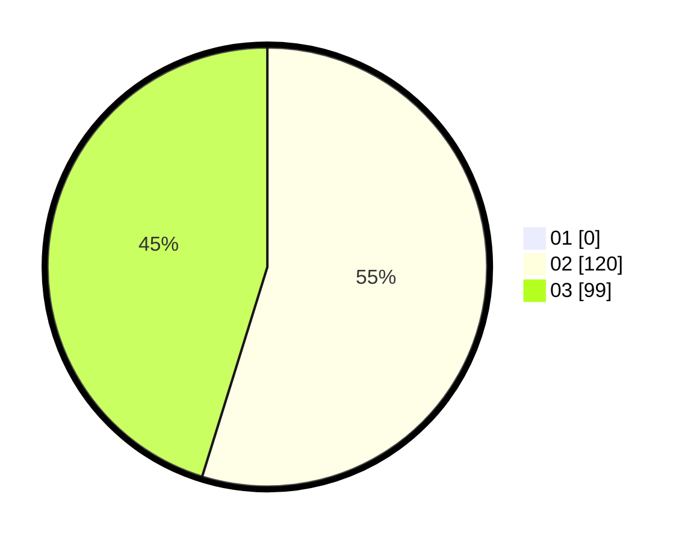

# Hasil

Hasil perolehan suara paslon dapat dilihat pada file paslon-01.txt, paslon-02.txt, dan paslon-03.txt.

Jika tidak ada, artinya data tersebut belum ada pada SIREKAP.

## Perolehan Suara

 * Paslon 01: **0**.
 * Paslon 02: **120**.
 * Paslon 03: **99**.

## Foto C Plano

https://sirekap-obj-formc.kpu.go.id/c6bc/pemilu/ppwp/31/73/06/10/05/3173061005246-20240215-215331--9a353bbe-5a82-472d-b142-6f9249e4a6ee.jpg

https://sirekap-obj-formc.kpu.go.id/c6bc/pemilu/ppwp/31/73/06/10/05/3173061005246-20240214-191644--4d1dd4a0-dfc2-45eb-b36c-0e0bf58a6fdd.jpg

https://sirekap-obj-formc.kpu.go.id/c6bc/pemilu/ppwp/31/73/06/10/05/3173061005246-20240214-192137--4dbefa56-1278-435b-b5d9-17f5b8c4e927.jpg

## DATA PEMILIH TETAP

Jumlah pemilih dalam DPT: **261**.
 * L: **135**.
 * P: **126**.

## DATA PENGGUNA HAK PILIH

Jumlah pengguna hak pilih dalam DPT: **203**.
 * L: **101**.
 * P: **102**.

Jumlah pengguna hak pilih dalam DPTb: **7**.
 * L: **3**.
 * P: **4**.

Jumlah pengguna hak pilih dalam DPK: **12**.
 * L: **3**.
 * P: **9**.

Jumlah pengguna hak pilih: **222**.
 * L: **107**.
 * P: **115**.

## JUMLAH SUARA SAH DAN TIDAK SAH

JUMLAH SELURUH SUARA SAH: **219**.

JUMLAH SUARA TIDAK SAH: **3**.

JUMLAH SELURUH SUARA SAH DAN SUARA TIDAK SAH: **222**.
