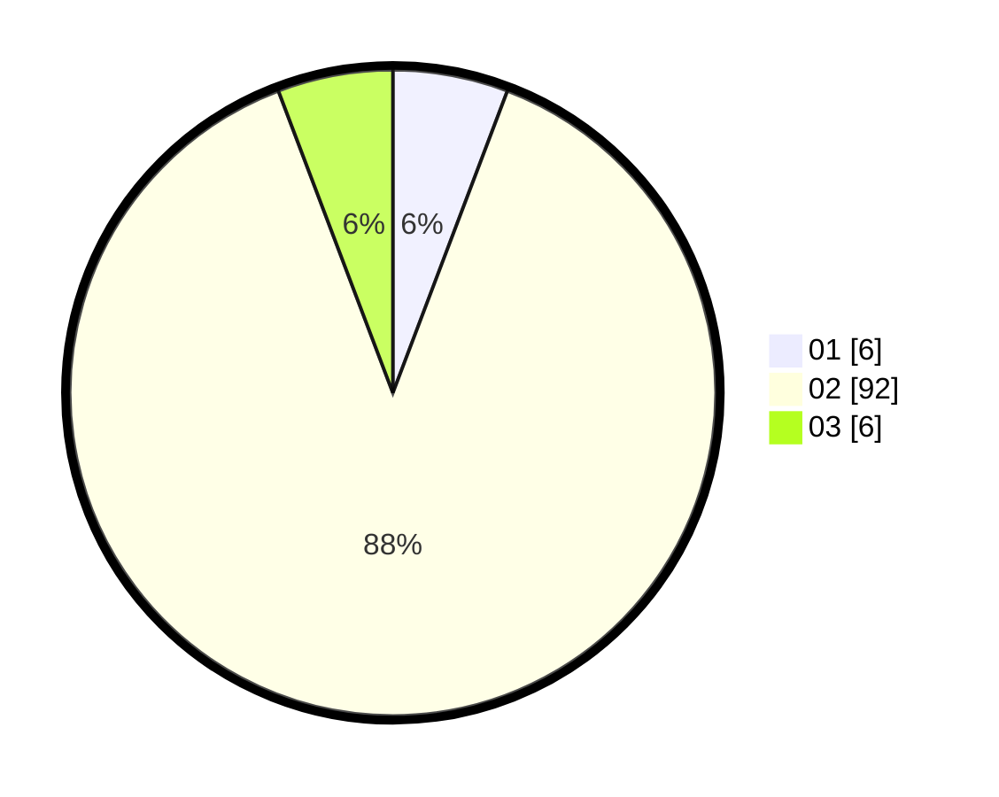

# Hasil

Hasil perolehan suara paslon dapat dilihat pada file paslon-01.txt, paslon-02.txt, dan paslon-03.txt.

Jika tidak ada, artinya data tersebut belum ada pada SIREKAP.

## Perolehan Suara

 * Paslon 01: **6**.
 * Paslon 02: **92**.
 * Paslon 03: **6**.

## Foto C Plano

https://sirekap-obj-formc.kpu.go.id/0f01/pemilu/ppwp/31/73/06/10/05/3173061005250-20240214-200452--2d86f7d2-1b9a-41bf-8e40-f97c2f10cc5c.jpg

https://sirekap-obj-formc.kpu.go.id/0f01/pemilu/ppwp/31/73/06/10/05/3173061005250-20240214-200541--1ef49140-9985-4ae9-a748-73b1a91bd69a.jpg

https://sirekap-obj-formc.kpu.go.id/0f01/pemilu/ppwp/31/73/06/10/05/3173061005250-20240214-200622--ca0bde19-567d-4348-9ee7-5a9003370409.jpg
