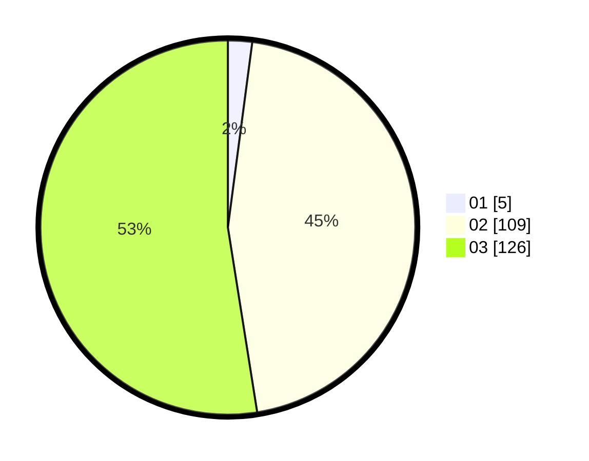

# Hasil

Hasil perolehan suara paslon dapat dilihat pada file paslon-01.txt, paslon-02.txt, dan paslon-03.txt.

Jika tidak ada, artinya data tersebut belum ada pada SIREKAP.

## Perolehan Suara

 * Paslon 01: **5**.
 * Paslon 02: **109**.
 * Paslon 03: **126**.

## Foto C Plano

https://sirekap-obj-formc.kpu.go.id/cb53/pemilu/ppwp/31/73/06/10/05/3173061005252-20240214-155914--1393485e-0f54-4849-9990-ca4453fe067c.jpg

https://sirekap-obj-formc.kpu.go.id/cb53/pemilu/ppwp/31/73/06/10/05/3173061005252-20240214-160113--3060a821-5a28-4410-9255-119c2dc670e9.jpg

https://sirekap-obj-formc.kpu.go.id/cb53/pemilu/ppwp/31/73/06/10/05/3173061005252-20240214-160137--b8a2f480-5eef-4fcd-978a-15f942a1f7fe.jpg

## DATA PEMILIH TETAP

Jumlah pemilih dalam DPT: **294**.
 * L: **135**.
 * P: **159**.

## DATA PENGGUNA HAK PILIH

Jumlah pengguna hak pilih dalam DPT: **234**.
 * L: **105**.
 * P: **129**.

Jumlah pengguna hak pilih dalam DPTb: **5**.
 * L: **2**.
 * P: **3**.

Jumlah pengguna hak pilih dalam DPK: **2**.
 * L: **1**.
 * P: **1**.

Jumlah pengguna hak pilih: **241**.
 * L: **108**.
 * P: **133**.

## JUMLAH SUARA SAH DAN TIDAK SAH

JUMLAH SELURUH SUARA SAH: **240**.

JUMLAH SUARA TIDAK SAH: **1**.

JUMLAH SELURUH SUARA SAH DAN SUARA TIDAK SAH: **241**.
