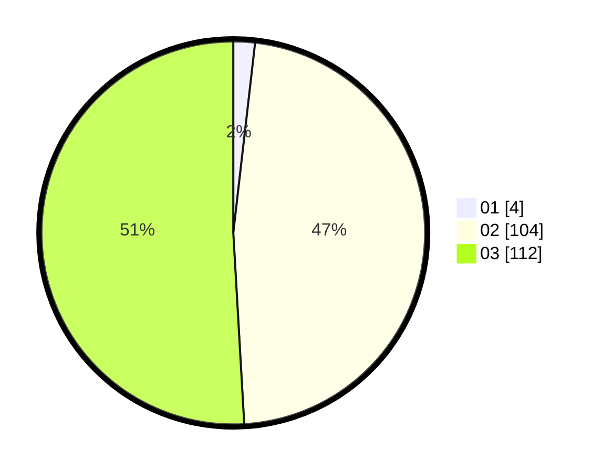

# Hasil

Hasil perolehan suara paslon dapat dilihat pada file paslon-01.txt, paslon-02.txt, dan paslon-03.txt.

Jika tidak ada, artinya data tersebut belum ada pada SIREKAP.

## Perolehan Suara

 * Paslon 01: **4**.
 * Paslon 02: **104**.
 * Paslon 03: **112**.

## Foto C Plano

https://sirekap-obj-formc.kpu.go.id/52ff/pemilu/ppwp/31/73/06/10/05/3173061005253-20240215-234111--2972d644-15be-4b99-9c62-e7d2a7e2f744.jpg

https://sirekap-obj-formc.kpu.go.id/52ff/pemilu/ppwp/31/73/06/10/05/3173061005253-20240215-234114--b67d5ec6-329f-47a7-8aa8-fabbec372488.jpg

https://sirekap-obj-formc.kpu.go.id/52ff/pemilu/ppwp/31/73/06/10/05/3173061005253-20240215-234112--2e921456-84e9-499e-a865-6f1255351518.jpg

## DATA PEMILIH TETAP

Jumlah pemilih dalam DPT: **273**.
 * L: **146**.
 * P: **127**.

## DATA PENGGUNA HAK PILIH

Jumlah pengguna hak pilih dalam DPT: **219**.
 * L: **115**.
 * P: **104**.

Jumlah pengguna hak pilih dalam DPTb: **2**.
 * L: **1**.
 * P: **1**.

Jumlah pengguna hak pilih dalam DPK: **1**.
 * L: **0**.
 * P: **1**.

Jumlah pengguna hak pilih: **222**.
 * L: **116**.
 * P: **106**.

## JUMLAH SUARA SAH DAN TIDAK SAH

JUMLAH SELURUH SUARA SAH: **220**.

JUMLAH SUARA TIDAK SAH: **2**.

JUMLAH SELURUH SUARA SAH DAN SUARA TIDAK SAH: **222**.
