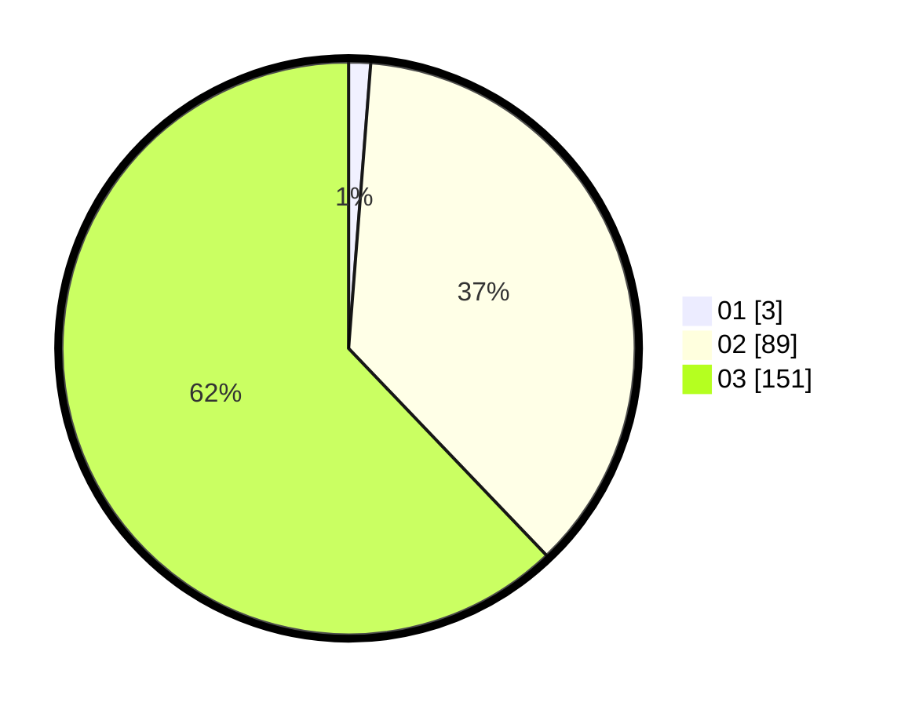

# Hasil

Hasil perolehan suara paslon dapat dilihat pada file paslon-01.txt, paslon-02.txt, dan paslon-03.txt.

Jika tidak ada, artinya data tersebut belum ada pada SIREKAP.

## Perolehan Suara

 * Paslon 01: **3**.
 * Paslon 02: **89**.
 * Paslon 03: **151**.

## Foto C Plano

https://sirekap-obj-formc.kpu.go.id/85fa/pemilu/ppwp/31/73/06/10/05/3173061005254-20240216-000420--0a054e5c-575b-447d-8d65-91912d114d4f.jpg

https://sirekap-obj-formc.kpu.go.id/85fa/pemilu/ppwp/31/73/06/10/05/3173061005254-20240216-000424--2ea5e7c7-d1d3-4696-bdfe-088e3ade2fb9.jpg

https://sirekap-obj-formc.kpu.go.id/85fa/pemilu/ppwp/31/73/06/10/05/3173061005254-20240216-000421--c65e240c-d6f6-4e37-b101-ebc12ec59277.jpg

## DATA PEMILIH TETAP

Jumlah pemilih dalam DPT: **291**.
 * L: **147**.
 * P: **144**.

## DATA PENGGUNA HAK PILIH

Jumlah pengguna hak pilih dalam DPT: **235**.
 * L: **116**.
 * P: **119**.

Jumlah pengguna hak pilih dalam DPTb: **2**.
 * L: **1**.
 * P: **1**.

Jumlah pengguna hak pilih dalam DPK: **6**.
 * L: **0**.
 * P: **6**.

Jumlah pengguna hak pilih: **243**.
 * L: **117**.
 * P: **126**.

## JUMLAH SUARA SAH DAN TIDAK SAH

JUMLAH SELURUH SUARA SAH: **243**.

JUMLAH SUARA TIDAK SAH: **0**.

JUMLAH SELURUH SUARA SAH DAN SUARA TIDAK SAH: **243**.
