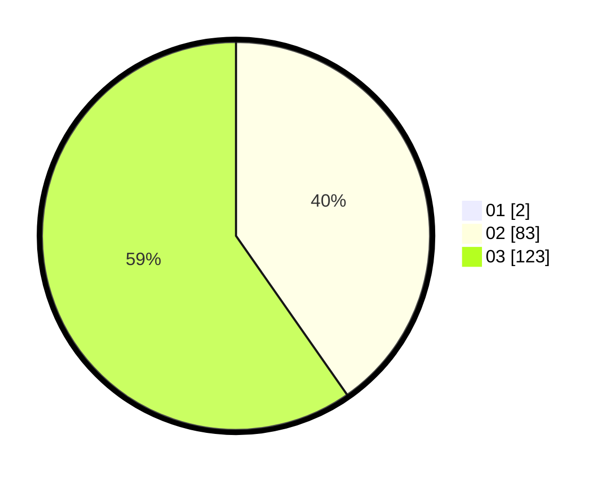

# Hasil

Hasil perolehan suara paslon dapat dilihat pada file paslon-01.txt, paslon-02.txt, dan paslon-03.txt.

Jika tidak ada, artinya data tersebut belum ada pada SIREKAP.

## Perolehan Suara

 * Paslon 01: **2**.
 * Paslon 02: **83**.
 * Paslon 03: **123**.

## Foto C Plano

https://sirekap-obj-formc.kpu.go.id/3d7f/pemilu/ppwp/31/73/06/10/05/3173061005265-20240214-211801--486e8522-9b3a-46ff-8a70-d6e8c7fc2e62.jpg

https://sirekap-obj-formc.kpu.go.id/3d7f/pemilu/ppwp/31/73/06/10/05/3173061005265-20240214-215111--cad9a4cd-2c88-4922-af9f-778dab1ba1f2.jpg

https://sirekap-obj-formc.kpu.go.id/3d7f/pemilu/ppwp/31/73/06/10/05/3173061005265-20240214-215126--f4cb79ba-13d6-41b9-b50d-b9fa00e38315.jpg

## DATA PEMILIH TETAP

Jumlah pemilih dalam DPT: **275**.
 * L: **136**.
 * P: **139**.

## DATA PENGGUNA HAK PILIH

Jumlah pengguna hak pilih dalam DPT: **204**.
 * L: **102**.
 * P: **102**.

Jumlah pengguna hak pilih dalam DPTb: **6**.
 * L: **4**.
 * P: **2**.

Jumlah pengguna hak pilih dalam DPK: **0**.
 * L: **0**.
 * P: **0**.

Jumlah pengguna hak pilih: **210**.
 * L: **106**.
 * P: **104**.

## JUMLAH SUARA SAH DAN TIDAK SAH

JUMLAH SELURUH SUARA SAH: **208**.

JUMLAH SUARA TIDAK SAH: **2**.

JUMLAH SELURUH SUARA SAH DAN SUARA TIDAK SAH: **210**.
