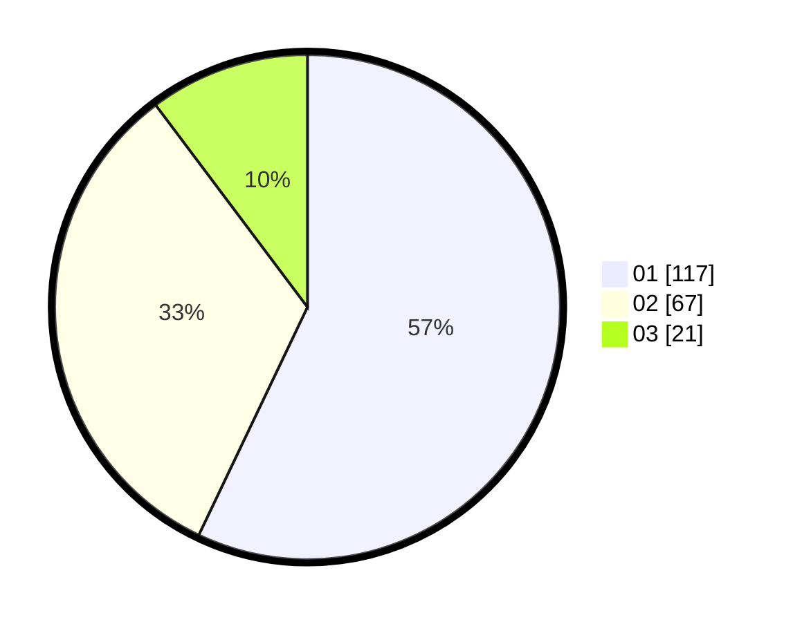

# Hasil

Hasil perolehan suara paslon dapat dilihat pada file paslon-01.txt, paslon-02.txt, dan paslon-03.txt.

Jika tidak ada, artinya data tersebut belum ada pada SIREKAP.

## Perolehan Suara

 * Paslon 01: **117**.
 * Paslon 02: **67**.
 * Paslon 03: **21**.

## Foto C Plano

https://sirekap-obj-formc.kpu.go.id/a993/pemilu/ppwp/31/73/07/10/01/3173071001002-20240216-172314--c443f031-fe55-497c-9463-23ea0bc5bbc9.jpg

https://sirekap-obj-formc.kpu.go.id/a993/pemilu/ppwp/31/73/07/10/01/3173071001002-20240216-172404--f47c5562-a374-4ad7-b9a3-44ed6f113dba.jpg

https://sirekap-obj-formc.kpu.go.id/a993/pemilu/ppwp/31/73/07/10/01/3173071001002-20240216-172828--ca4a0fbb-e93b-43e3-9ef1-627044befdbe.jpg

## DATA PEMILIH TETAP

Jumlah pemilih dalam DPT: **249**.
 * L: **132**.
 * P: **117**.

## DATA PENGGUNA HAK PILIH

Jumlah pengguna hak pilih dalam DPT: **199**.
 * L: **105**.
 * P: **94**.

Jumlah pengguna hak pilih dalam DPTb: **4**.
 * L: **1**.
 * P: **3**.

Jumlah pengguna hak pilih dalam DPK: **4**.
 * L: **1**.
 * P: **3**.

Jumlah pengguna hak pilih: **207**.
 * L: **107**.
 * P: **100**.

## JUMLAH SUARA SAH DAN TIDAK SAH

JUMLAH SELURUH SUARA SAH: **205**.

JUMLAH SUARA TIDAK SAH: **2**.

JUMLAH SELURUH SUARA SAH DAN SUARA TIDAK SAH: **207**.
