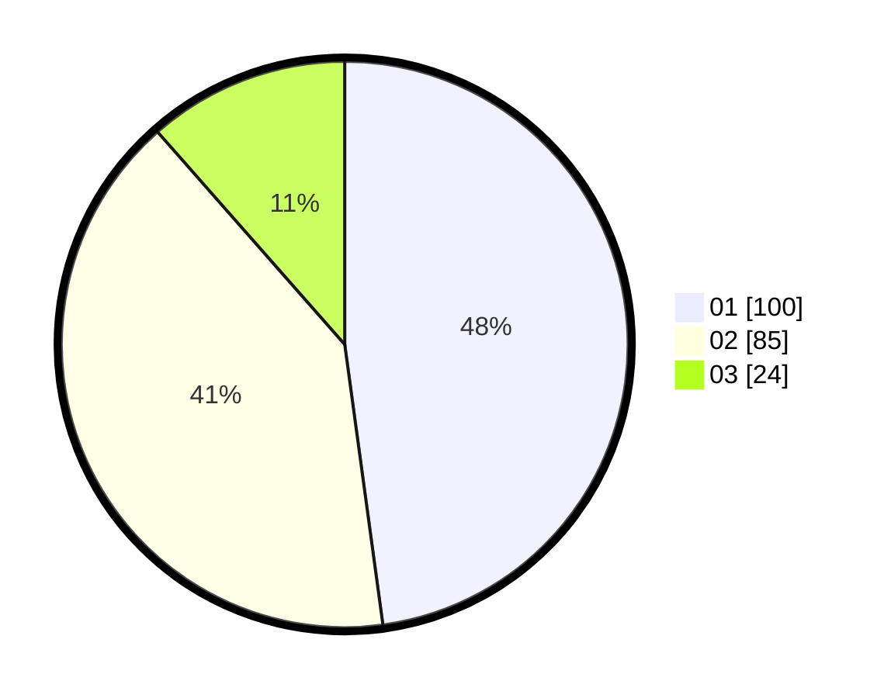

# Hasil

Hasil perolehan suara paslon dapat dilihat pada file paslon-01.txt, paslon-02.txt, dan paslon-03.txt.

Jika tidak ada, artinya data tersebut belum ada pada SIREKAP.

## Perolehan Suara

 * Paslon 01: **100**.
 * Paslon 02: **85**.
 * Paslon 03: **24**.

## Foto C Plano

https://sirekap-obj-formc.kpu.go.id/c6cc/pemilu/ppwp/31/73/07/10/01/3173071001005-20240214-155324--80907182-4faf-4b8b-8a0e-3a5e0eaff93d.jpg

https://sirekap-obj-formc.kpu.go.id/c6cc/pemilu/ppwp/31/73/07/10/01/3173071001005-20240214-155345--b1c701fe-0706-4a9e-b65b-9fde2288a509.jpg

https://sirekap-obj-formc.kpu.go.id/c6cc/pemilu/ppwp/31/73/07/10/01/3173071001005-20240214-155351--7ee613dc-11fb-40d4-8d3b-3990c29d9d00.jpg

## DATA PEMILIH TETAP

Jumlah pemilih dalam DPT: **248**.
 * L: **124**.
 * P: **124**.

## DATA PENGGUNA HAK PILIH

Jumlah pengguna hak pilih dalam DPT: **207**.
 * L: **102**.
 * P: **105**.

Jumlah pengguna hak pilih dalam DPTb: **6**.
 * L: **3**.
 * P: **3**.

Jumlah pengguna hak pilih dalam DPK: **2**.
 * L: **0**.
 * P: **2**.

Jumlah pengguna hak pilih: **215**.
 * L: **105**.
 * P: **110**.

## JUMLAH SUARA SAH DAN TIDAK SAH

JUMLAH SELURUH SUARA SAH: **209**.

JUMLAH SUARA TIDAK SAH: **6**.

JUMLAH SELURUH SUARA SAH DAN SUARA TIDAK SAH: **215**.
