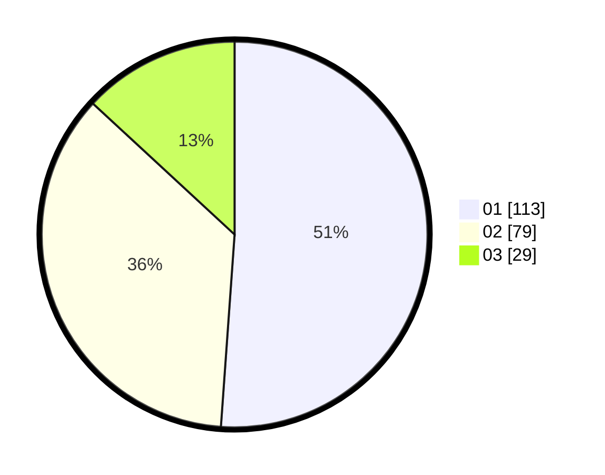

# Hasil

Hasil perolehan suara paslon dapat dilihat pada file paslon-01.txt, paslon-02.txt, dan paslon-03.txt.

Jika tidak ada, artinya data tersebut belum ada pada SIREKAP.

## Perolehan Suara

 * Paslon 01: **113**.
 * Paslon 02: **79**.
 * Paslon 03: **29**.

## Foto C Plano

https://sirekap-obj-formc.kpu.go.id/d1e1/pemilu/ppwp/31/73/07/10/01/3173071001006-20240214-160120--cd1cd8df-a9bc-4f4e-96bc-1732856c9fad.jpg

https://sirekap-obj-formc.kpu.go.id/d1e1/pemilu/ppwp/31/73/07/10/01/3173071001006-20240214-160054--c4595647-ea6d-447f-b673-e0bcf2f8744b.jpg

https://sirekap-obj-formc.kpu.go.id/d1e1/pemilu/ppwp/31/73/07/10/01/3173071001006-20240214-155249--e499d6f9-8170-43df-8bfe-1014cd84ad02.jpg
