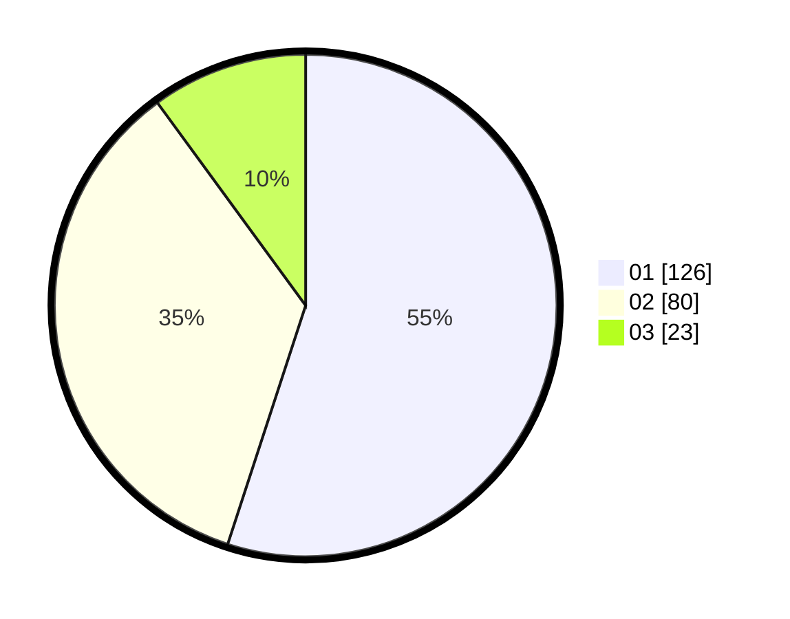

# Hasil

Hasil perolehan suara paslon dapat dilihat pada file paslon-01.txt, paslon-02.txt, dan paslon-03.txt.

Jika tidak ada, artinya data tersebut belum ada pada SIREKAP.

## Perolehan Suara

 * Paslon 01: **126**.
 * Paslon 02: **80**.
 * Paslon 03: **23**.

## Foto C Plano

https://sirekap-obj-formc.kpu.go.id/24a3/pemilu/ppwp/31/73/07/10/01/3173071001012-20240216-203503--a99d808d-6602-44f7-bb2c-3267bb7de2e4.jpg

https://sirekap-obj-formc.kpu.go.id/24a3/pemilu/ppwp/31/73/07/10/01/3173071001012-20240214-225002--f8124248-624a-44b3-a183-72cae1db9f60.jpg

https://sirekap-obj-formc.kpu.go.id/24a3/pemilu/ppwp/31/73/07/10/01/3173071001012-20240214-232618--3119eff8-73ab-4d65-a19a-87bee96f005a.jpg
