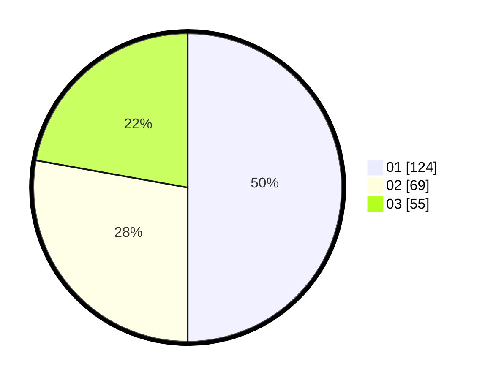

# Hasil

Hasil perolehan suara paslon dapat dilihat pada file paslon-01.txt, paslon-02.txt, dan paslon-03.txt.

Jika tidak ada, artinya data tersebut belum ada pada SIREKAP.

## Perolehan Suara

 * Paslon 01: **124**.
 * Paslon 02: **69**.
 * Paslon 03: **55**.

## Foto C Plano

https://sirekap-obj-formc.kpu.go.id/36e3/pemilu/ppwp/31/73/07/10/01/3173071001013-20240215-011221--a9a1c5e2-0224-4cf6-aebd-064868235612.jpg

https://sirekap-obj-formc.kpu.go.id/36e3/pemilu/ppwp/31/73/07/10/01/3173071001013-20240215-011345--e31682d8-d97d-4095-bb74-3ecef89365a5.jpg

https://sirekap-obj-formc.kpu.go.id/36e3/pemilu/ppwp/31/73/07/10/01/3173071001013-20240215-011629--3f6e75cd-a298-456e-b9c8-7703c61be1f7.jpg
