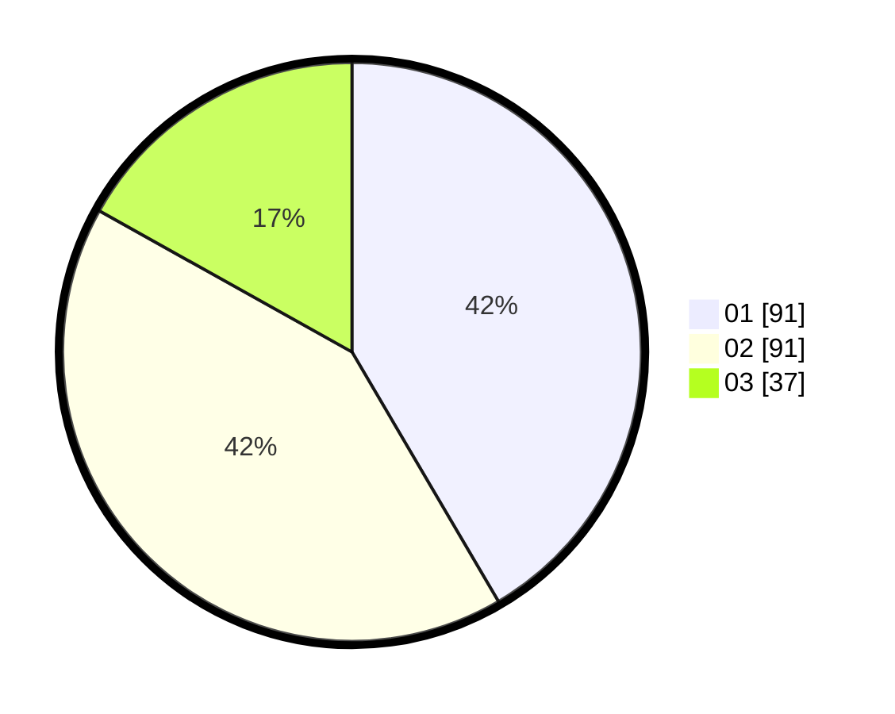

# Hasil

Hasil perolehan suara paslon dapat dilihat pada file paslon-01.txt, paslon-02.txt, dan paslon-03.txt.

Jika tidak ada, artinya data tersebut belum ada pada SIREKAP.

## Perolehan Suara

 * Paslon 01: **91**.
 * Paslon 02: **91**.
 * Paslon 03: **37**.

## Foto C Plano

https://sirekap-obj-formc.kpu.go.id/7e0a/pemilu/ppwp/31/73/07/10/01/3173071001017-20240215-001407--7f5b5ab2-2af4-4802-be53-4c3cc62b1c95.jpg

https://sirekap-obj-formc.kpu.go.id/7e0a/pemilu/ppwp/31/73/07/10/01/3173071001017-20240214-221254--f4caf038-9305-4fe3-8c91-97b5c8def4e7.jpg

https://sirekap-obj-formc.kpu.go.id/7e0a/pemilu/ppwp/31/73/07/10/01/3173071001017-20240215-001335--62b3cf79-eac1-4f26-bb1b-516d647c9812.jpg

## DATA PEMILIH TETAP

Jumlah pemilih dalam DPT: **280**.
 * L: **137**.
 * P: **143**.

## DATA PENGGUNA HAK PILIH

Jumlah pengguna hak pilih dalam DPT: **220**.
 * L: **106**.
 * P: **114**.

Jumlah pengguna hak pilih dalam DPTb: **1**.
 * L: **1**.
 * P: **0**.

Jumlah pengguna hak pilih dalam DPK: **1**.
 * L: **0**.
 * P: **1**.

Jumlah pengguna hak pilih: **222**.
 * L: **107**.
 * P: **115**.

## JUMLAH SUARA SAH DAN TIDAK SAH

JUMLAH SELURUH SUARA SAH: **219**.

JUMLAH SUARA TIDAK SAH: **3**.

JUMLAH SELURUH SUARA SAH DAN SUARA TIDAK SAH: **222**.
