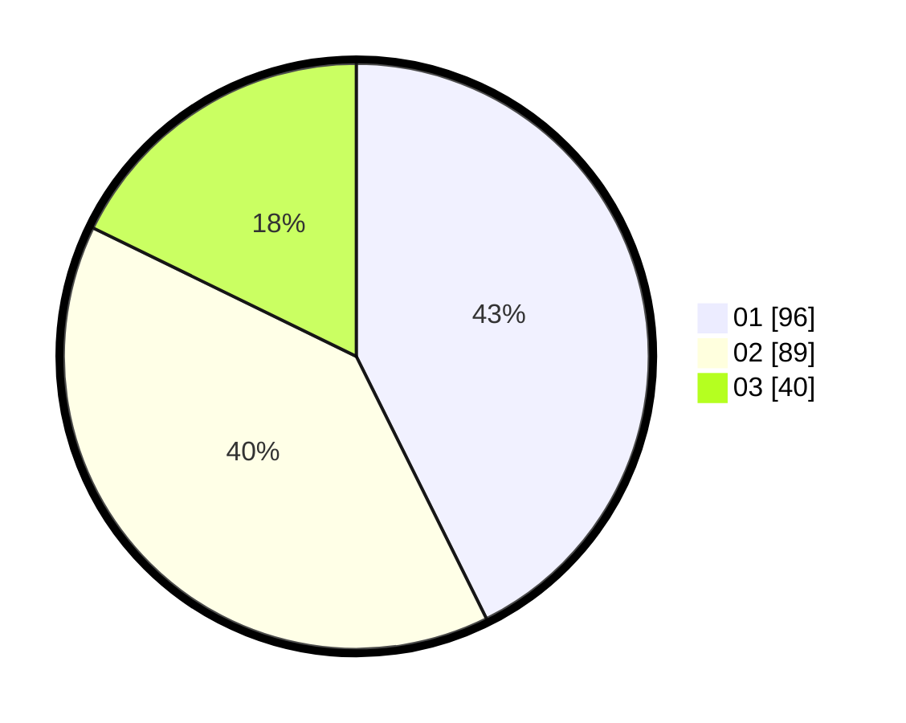

# Hasil

Hasil perolehan suara paslon dapat dilihat pada file paslon-01.txt, paslon-02.txt, dan paslon-03.txt.

Jika tidak ada, artinya data tersebut belum ada pada SIREKAP.

## Perolehan Suara

 * Paslon 01: **96**.
 * Paslon 02: **89**.
 * Paslon 03: **40**.

## Foto C Plano

https://sirekap-obj-formc.kpu.go.id/20a3/pemilu/ppwp/31/73/07/10/01/3173071001018-20240215-014100--27a87da0-f5db-4885-8da0-bf0b29ae6096.jpg

https://sirekap-obj-formc.kpu.go.id/20a3/pemilu/ppwp/31/73/07/10/01/3173071001018-20240215-014342--8079f488-042a-4cc2-94c4-c3e061df022a.jpg

https://sirekap-obj-formc.kpu.go.id/20a3/pemilu/ppwp/31/73/07/10/01/3173071001018-20240214-214310--a21288ba-93b3-4aae-a294-6ca7d92034d9.jpg
