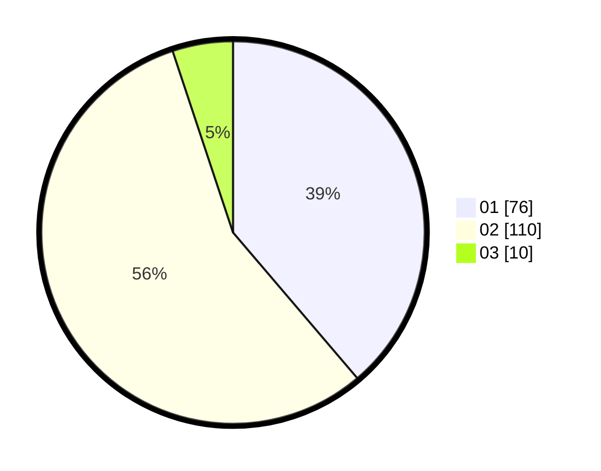

# Hasil

Hasil perolehan suara paslon dapat dilihat pada file paslon-01.txt, paslon-02.txt, dan paslon-03.txt.

Jika tidak ada, artinya data tersebut belum ada pada SIREKAP.

## Perolehan Suara

 * Paslon 01: **76**.
 * Paslon 02: **110**.
 * Paslon 03: **10**.

## Foto C Plano

https://sirekap-obj-formc.kpu.go.id/36fc/pemilu/ppwp/31/73/07/10/01/3173071001019-20240214-210123--a091ebf4-a6fc-4e5c-98aa-2f4fbdb8a5fa.jpg

https://sirekap-obj-formc.kpu.go.id/36fc/pemilu/ppwp/31/73/07/10/01/3173071001019-20240214-210304--fbe4464f-4cde-4568-98ed-6a863956bfbc.jpg

https://sirekap-obj-formc.kpu.go.id/36fc/pemilu/ppwp/31/73/07/10/01/3173071001019-20240214-210410--e711b357-c143-4e70-b7b4-6e0b052e834e.jpg
