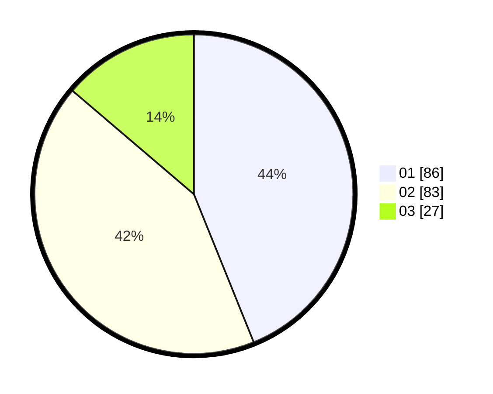

# Hasil

Hasil perolehan suara paslon dapat dilihat pada file paslon-01.txt, paslon-02.txt, dan paslon-03.txt.

Jika tidak ada, artinya data tersebut belum ada pada SIREKAP.

## Perolehan Suara

 * Paslon 01: **86**.
 * Paslon 02: **83**.
 * Paslon 03: **27**.

## Foto C Plano

https://sirekap-obj-formc.kpu.go.id/7cc9/pemilu/ppwp/31/73/07/10/01/3173071001021-20240214-221434--05594db5-c904-4cd6-b432-de84a993ea0f.jpg

https://sirekap-obj-formc.kpu.go.id/7cc9/pemilu/ppwp/31/73/07/10/01/3173071001021-20240214-230626--3af8e7cc-dfbd-4956-9833-44bab53d2a5e.jpg

https://sirekap-obj-formc.kpu.go.id/7cc9/pemilu/ppwp/31/73/07/10/01/3173071001021-20240214-230657--ba9882b8-b830-4acf-81ef-8f0f986fc08c.jpg
