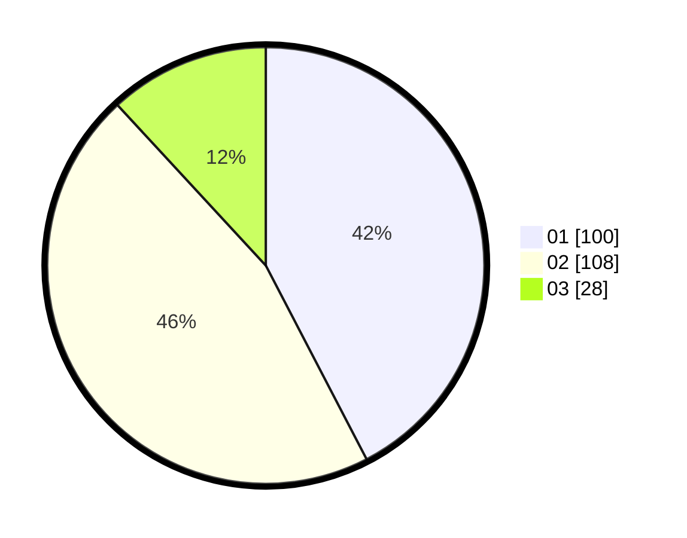

# Hasil

Hasil perolehan suara paslon dapat dilihat pada file paslon-01.txt, paslon-02.txt, dan paslon-03.txt.

Jika tidak ada, artinya data tersebut belum ada pada SIREKAP.

## Perolehan Suara

 * Paslon 01: **100**.
 * Paslon 02: **108**.
 * Paslon 03: **28**.

## Foto C Plano

https://sirekap-obj-formc.kpu.go.id/55b2/pemilu/ppwp/31/73/07/10/01/3173071001023-20240215-003217--6fb99dac-5a5a-49b1-81a2-89b1165b25de.jpg

https://sirekap-obj-formc.kpu.go.id/55b2/pemilu/ppwp/31/73/07/10/01/3173071001023-20240215-003333--2b6644e4-aff6-44ac-996f-7efb54e62fd8.jpg

https://sirekap-obj-formc.kpu.go.id/55b2/pemilu/ppwp/31/73/07/10/01/3173071001023-20240215-003439--309fb707-5ac8-4280-90f3-47de343dcf35.jpg
