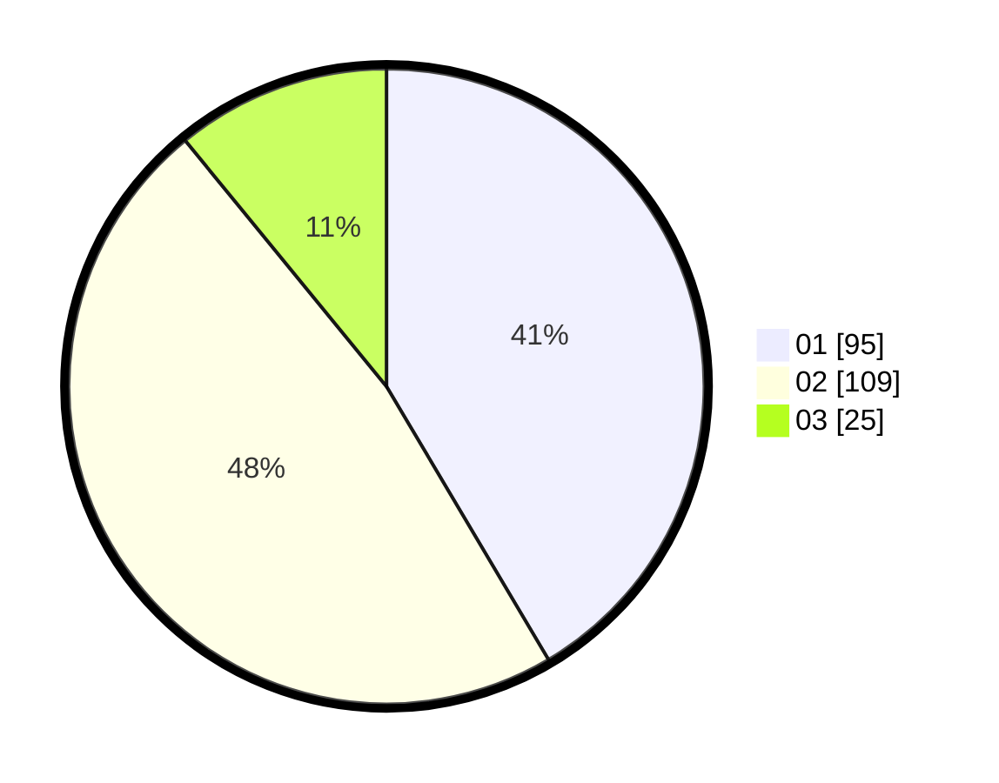

# Hasil

Hasil perolehan suara paslon dapat dilihat pada file paslon-01.txt, paslon-02.txt, dan paslon-03.txt.

Jika tidak ada, artinya data tersebut belum ada pada SIREKAP.

## Perolehan Suara

 * Paslon 01: **95**.
 * Paslon 02: **109**.
 * Paslon 03: **25**.

## Foto C Plano

https://sirekap-obj-formc.kpu.go.id/db57/pemilu/ppwp/31/73/07/10/01/3173071001024-20240214-211154--4d1be945-37f8-4a3a-8310-dce49704ba90.jpg

https://sirekap-obj-formc.kpu.go.id/db57/pemilu/ppwp/31/73/07/10/01/3173071001024-20240214-211311--331842ed-af6f-4bb0-ba0b-4eece8960bfb.jpg
