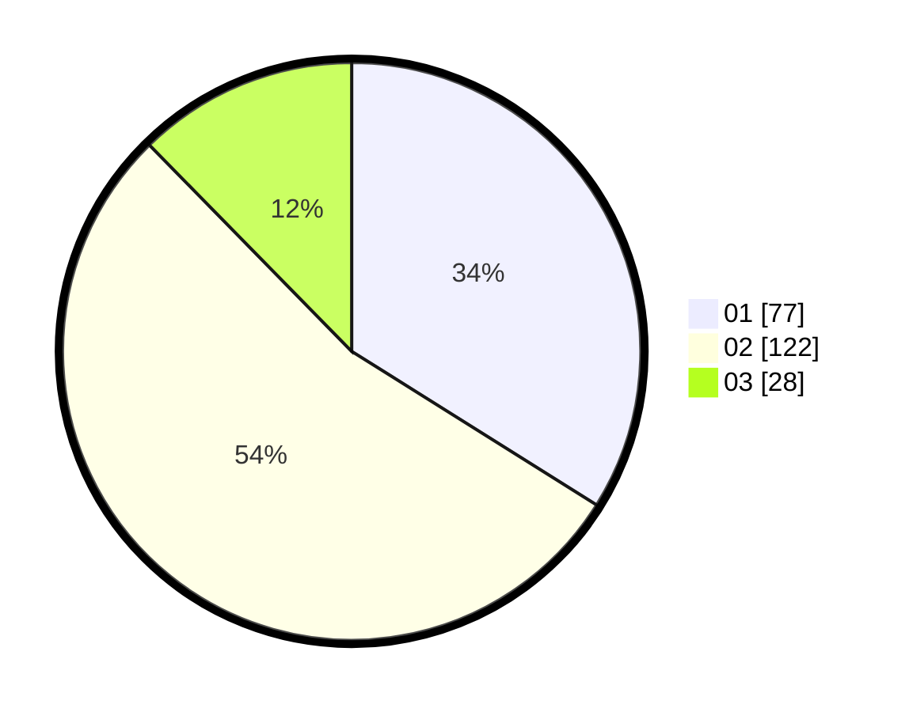

# Hasil

Hasil perolehan suara paslon dapat dilihat pada file paslon-01.txt, paslon-02.txt, dan paslon-03.txt.

Jika tidak ada, artinya data tersebut belum ada pada SIREKAP.

## Perolehan Suara

 * Paslon 01: **77**.
 * Paslon 02: **122**.
 * Paslon 03: **28**.

## Foto C Plano

https://sirekap-obj-formc.kpu.go.id/a702/pemilu/ppwp/31/73/07/10/01/3173071001025-20240214-221144--0d9fa7f1-905e-4dbc-b323-80f2d19c3f09.jpg

https://sirekap-obj-formc.kpu.go.id/a702/pemilu/ppwp/31/73/07/10/01/3173071001025-20240214-215110--ff7390ca-3eb3-4d3a-8790-ad06e62febc1.jpg

https://sirekap-obj-formc.kpu.go.id/a702/pemilu/ppwp/31/73/07/10/01/3173071001025-20240214-215245--72313dae-3c7e-4776-91b0-60589b0fd467.jpg
