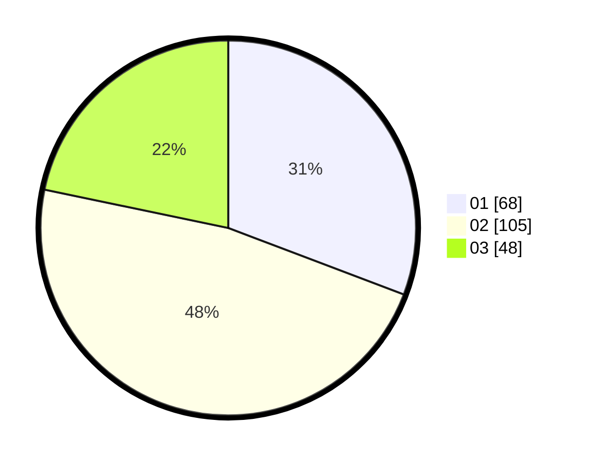

# Hasil

Hasil perolehan suara paslon dapat dilihat pada file paslon-01.txt, paslon-02.txt, dan paslon-03.txt.

Jika tidak ada, artinya data tersebut belum ada pada SIREKAP.

## Perolehan Suara

 * Paslon 01: **68**.
 * Paslon 02: **105**.
 * Paslon 03: **48**.

## Foto C Plano

https://sirekap-obj-formc.kpu.go.id/b602/pemilu/ppwp/31/73/07/10/01/3173071001028-20240214-214458--ead922d8-b70c-45de-b256-911b2b50a588.jpg

https://sirekap-obj-formc.kpu.go.id/b602/pemilu/ppwp/31/73/07/10/01/3173071001028-20240214-214735--4c9041d4-6aa0-404c-84a4-c8b410059ccc.jpg

https://sirekap-obj-formc.kpu.go.id/b602/pemilu/ppwp/31/73/07/10/01/3173071001028-20240214-215014--3b0c0dc3-6326-4e8b-b1b2-7d16d5237418.jpg
