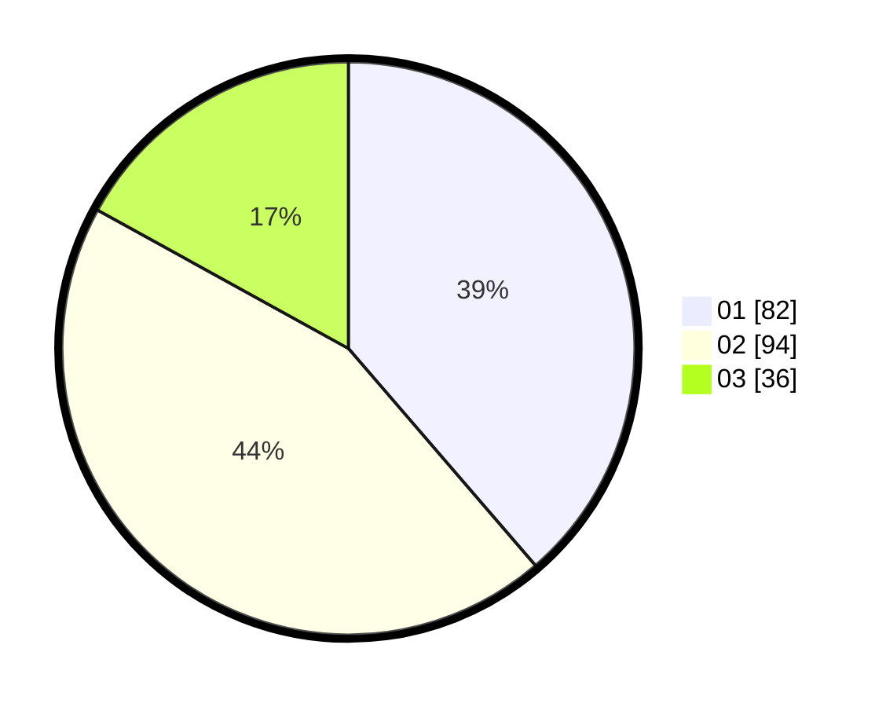

# Hasil

Hasil perolehan suara paslon dapat dilihat pada file paslon-01.txt, paslon-02.txt, dan paslon-03.txt.

Jika tidak ada, artinya data tersebut belum ada pada SIREKAP.

## Perolehan Suara

 * Paslon 01: **82**.
 * Paslon 02: **94**.
 * Paslon 03: **36**.

## Foto C Plano

https://sirekap-obj-formc.kpu.go.id/2aa6/pemilu/ppwp/31/73/07/10/01/3173071001030-20240214-213414--f89070a9-0b4e-4eba-9909-aae4e412a445.jpg

https://sirekap-obj-formc.kpu.go.id/2aa6/pemilu/ppwp/31/73/07/10/01/3173071001030-20240214-213501--d499e79e-896b-4d52-a5c1-4708e03c162d.jpg

https://sirekap-obj-formc.kpu.go.id/2aa6/pemilu/ppwp/31/73/07/10/01/3173071001030-20240214-213613--3e1be998-db60-45c2-a8af-8369484cfba8.jpg
